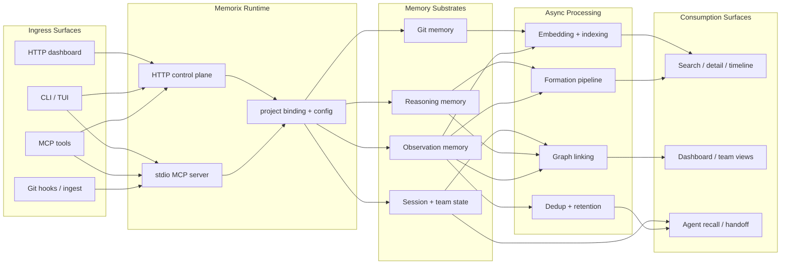

<p align="center">
  
</p>

<h1 align="center">Memorix</h1>

<p align="center">
  <strong>Open-source cross-agent memory layer for coding agents.</strong><br>
  Compatible with Cursor, Claude Code, Codex, Windsurf, Gemini CLI, GitHub Copilot, Kiro, OpenCode, Antigravity, and Trae through MCP.
</p>

<p align="center">
  <a href="https://www.npmjs.com/package/memorix"></a>
  <a href="https://www.npmjs.com/package/memorix"></a>
  <a href="LICENSE"></a>
  <a href="https://github.com/AVIDS2/memorix/actions/workflows/ci.yml"></a>
  <a href="https://github.com/AVIDS2/memorix"></a>
</p>

<p align="center">
  <strong>Git Memory</strong> | <strong>Reasoning Memory</strong> | <strong>Cross-Agent Recall</strong> | <strong>Control Plane Dashboard</strong>
</p>

<p align="center">
  <a href="README.zh-CN.md">中文说明</a> |
  <a href="#quick-start">Quick Start</a> |
  <a href="#supported-clients">Supported Clients</a> |
  <a href="#core-workflows">Core Workflows</a> |
  <a href="#documentation">Documentation</a> |
  <a href="docs/SETUP.md">Setup Guide</a>
</p>

---

## For Coding Agents

If you are using an AI coding agent to install or operate Memorix, have it read the [Agent Operator Playbook](docs/AGENT_OPERATOR_PLAYBOOK.md) first.

That playbook is the canonical AI-facing guide for:

- installation and runtime-mode selection
- Git/project binding rules
- stdio vs HTTP control-plane setup
- per-agent integration and hooks
- generated dot-directory behavior
- troubleshooting and safe operating rules

## Why Memorix

Most coding agents remember only the current thread. Memorix gives them a shared, persistent memory layer across IDEs, sessions, and projects.

What makes Memorix different:

- **Git Memory**: turn `git commit` into searchable engineering memory with noise filtering and commit provenance.
- **Reasoning Memory**: store why a decision was made, not just what changed.
- **Cross-Agent Local Recall**: multiple IDEs and agents can read the same local memory base instead of living in isolated silos.
- **Memory Quality Pipeline**: formation, compaction, retention, and source-aware retrieval work together instead of acting like isolated tools.

Memorix is built for one job: let multiple coding agents share the same durable project memory through MCP without giving up Git truth, reasoning history, or local control.

## Supported Clients

Memorix currently ships first-class integrations for:

- Cursor
- Claude Code
- Codex
- Windsurf
- Gemini CLI
- GitHub Copilot
- Kiro
- OpenCode
- Antigravity
- Trae

If a client can speak MCP and launch a local command or HTTP endpoint, it can usually connect to Memorix even if it is not in the list above yet.

---

## Quick Start

Install globally:

```bash
npm install -g memorix
```

Initialize project config:

```bash
memorix init
```

Memorix uses two files with two roles:

- `memorix.yml` for behavior and project settings
- `.env` for secrets such as API keys

Choose one runtime mode:

```bash
memorix serve
```

Use `serve` for normal stdio MCP integrations.

```bash
memorix serve-http --port 3211
```

Use `serve-http` when you want the HTTP transport, collaboration features, and the dashboard on the same port.

In HTTP control-plane mode, agents should call `memorix_session_start` with `projectRoot` set to the absolute path of the current workspace or repo root when that path is available. Git remains the source of truth for the final project identity; `projectRoot` is the detection anchor that keeps parallel sessions from drifting into the wrong project bucket.

Add Memorix to your MCP client:

<details open>
<summary><strong>Cursor</strong> | <code>.cursor/mcp.json</code></summary>

```json
{
  "mcpServers": {
    "memorix": {
      "command": "memorix",
      "args": ["serve"]
    }
  }
}
```
</details>

<details>
<summary><strong>Claude Code</strong></summary>

```bash
claude mcp add memorix -- memorix serve
```
</details>

<details>
<summary><strong>Codex</strong> | <code>~/.codex/config.toml</code></summary>

```toml
[mcp_servers.memorix]
command = "memorix"
args = ["serve"]
```
</details>

For the full IDE matrix, Windows notes, and troubleshooting, see [docs/SETUP.md](docs/SETUP.md).

---

## Core Workflows

### 1. Store and retrieve memory

Use MCP tools such as:

- `memorix_store`
- `memorix_search`
- `memorix_detail`
- `memorix_timeline`
- `memorix_resolve`

This covers decisions, gotchas, problem-solution notes, and session handoff context.

### 2. Capture Git truth automatically

Install the post-commit hook:

```bash
memorix git-hook --force
```

Or ingest manually:

```bash
memorix ingest commit
memorix ingest log --count 20
```

Git memories are stored with `source='git'`, commit hashes, changed files, and noise filtering.

### 3. Run the control plane

```bash
memorix serve-http --port 3211
```

Then open:

- MCP HTTP endpoint: `http://localhost:3211/mcp`
- Dashboard: `http://localhost:3211`

This mode gives you collaboration tools, project identity diagnostics, config provenance, Git Memory views, and the dashboard in one place.

When multiple HTTP sessions are open at once, each session should bind itself with `memorix_session_start(projectRoot=...)` before using project-scoped memory tools.

---

## How It Works



Memorix is not a single linear pipeline. It accepts memory from multiple ingress surfaces, persists it across multiple substrates, runs several asynchronous quality/indexing branches, and exposes the results through different retrieval and collaboration surfaces.

### Memory Layers

- **Observation Memory**: what changed, how something works, gotchas, problem-solution notes
- **Reasoning Memory**: why a choice was made, alternatives, trade-offs, risks
- **Git Memory**: immutable engineering facts derived from commits

### Retrieval Model

- Default search is **project-scoped**
- `scope="global"` searches across projects
- Global hits can be opened explicitly with project-aware refs
- Source-aware retrieval boosts Git memories for "what changed" questions and reasoning memories for "why" questions

---

## Documentation

### Getting Started

- [Setup Guide](docs/SETUP.md)
- [Configuration Guide](docs/CONFIGURATION.md)

### Product and Architecture

- [Architecture](docs/ARCHITECTURE.md)
- [Memory Formation Pipeline](docs/MEMORY_FORMATION_PIPELINE.md)
- [Design Decisions](docs/DESIGN_DECISIONS.md)

### Reference

- [API Reference](docs/API_REFERENCE.md)
- [Git Memory Guide](docs/GIT_MEMORY.md)
- [Modules](docs/MODULES.md)

### Development

- [Development Guide](docs/DEVELOPMENT.md)
- [Known Issues and Roadmap](docs/KNOWN_ISSUES_AND_ROADMAP.md)

### AI-Facing Project Docs

- [Agent Operator Playbook](docs/AGENT_OPERATOR_PLAYBOOK.md)
- [`llms.txt`](llms.txt)
- [`llms-full.txt`](llms-full.txt)

---

## Development

```bash
git clone https://github.com/AVIDS2/memorix.git
cd memorix
npm install

npm run dev
npm test
npm run build
```

Key local commands:

```bash
memorix status
memorix dashboard
memorix serve-http --port 3211
memorix git-hook --force
```

---

## Acknowledgements

Memorix builds on ideas from [mcp-memory-service](https://github.com/doobidoo/mcp-memory-service), [MemCP](https://github.com/maydali28/memcp), [claude-mem](https://github.com/anthropics/claude-code), [Mem0](https://github.com/mem0ai/mem0), and the broader MCP ecosystem.

## Star History

<a href="https://star-history.com/#AVIDS2/memorix&Date">
 <picture>
   <source media="(prefers-color-scheme: dark)" srcset="https://api.star-history.com/svg?repos=AVIDS2/memorix&type=Date&theme=dark" />
   <source media="(prefers-color-scheme: light)" srcset="https://api.star-history.com/svg?repos=AVIDS2/memorix&type=Date" />
   
 </picture>
</a>

## License

[Apache 2.0](LICENSE)
