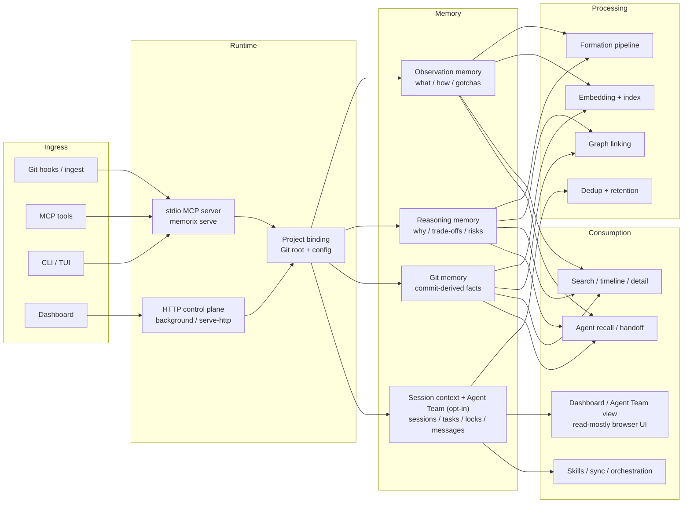

<p align="center">
  
</p>

<h1 align="center">Memorix</h1>

<p align="center">
  <strong>Open-source memory control plane for coding agents.</strong><br>
  CLI-first, MCP-compatible, local-first.<br>
  Tiered MCP support across Cursor, Claude Code, Codex, Windsurf, Gemini CLI, GitHub Copilot, Kiro, OpenCode, Antigravity, Trae, and other MCP-compatible clients.
</p>

<p align="center">
  <a href="https://www.npmjs.com/package/memorix"></a>
  <a href="https://www.npmjs.com/package/memorix"></a>
  <a href="LICENSE"></a>
  <a href="https://github.com/AVIDS2/memorix/actions/workflows/ci.yml"></a>
  <a href="https://github.com/AVIDS2/memorix"></a>
</p>

<p align="center">
  <strong>Three-Layer Memory</strong> | <strong>CLI Workbench</strong> | <strong>MCP Integration</strong> | <strong>Autonomous Agent Loops</strong> | <strong>Dashboard</strong>
</p>

<p align="center">
  <a href="README.zh-CN.md">Chinese</a> |
  <a href="#quick-start">Quick Start</a> |
  <a href="#why-memorix">Why Memorix</a> |
  <a href="#client-support">Client Support</a> |
  <a href="#documentation">Documentation</a> |
  <a href="docs/SETUP.md">Setup Guide</a>
</p>

---

> Using Memorix through Cursor, Windsurf, Claude Code, Codex, or another coding agent? Read the [Agent Operator Playbook](docs/AGENT_OPERATOR_PLAYBOOK.md) for the agent-facing install, MCP, hook, and troubleshooting rules.

## What Is Memorix?

Memorix is a local-first memory control plane for coding agents.

It keeps project memory, reasoning context, Git-derived facts, and optional autonomous-agent coordination in one place so work can continue across IDEs, terminals, sessions, and agent runs without losing project truth.

The default path is intentionally light:

- use `memorix` for the terminal workbench
- use `memorix serve` for stdio MCP in one IDE
- move to HTTP only when you explicitly want a shared background control plane or live dashboard endpoint

## Why Memorix

| Capability | What you get |
| --- | --- |
| Three-layer memory | Observation memory for what/how, reasoning memory for why, Git memory for commit-derived facts |
| CLI-first surface | A full operator CLI for sessions, memory, reasoning, retention, team, tasks, sync, ingest, and more |
| MCP integration | Works with MCP-capable IDEs and coding agents without making MCP the only way to operate Memorix |
| Local-first runtime | SQLite + local search by default, no required cloud backend |
| Autonomous agent workflows | Optional task board, messaging, file locks, and `memorix orchestrate` for structured CLI-agent loops |
| Read-mostly dashboard | Local browser UI for memory, sessions, Git view, and autonomous agent state |

## Quick Start

Install globally:

```bash
npm install -g memorix
```

Initialize config:

```bash
memorix init
```

Then choose the path that matches what you want:

| You want | Run | Notes |
| --- | --- | --- |
| Interactive terminal workbench | `memorix` | Best default starting point |
| MCP inside one IDE | `memorix serve` | Default stdio MCP path |
| Shared background control plane | `memorix background start` | Optional HTTP mode |
| Foreground HTTP for debugging | `memorix serve-http --port 3211` | Manual supervision and custom ports |

Most users should start with `memorix` or `memorix serve`.

Generic stdio MCP config:

```json
{
  "mcpServers": {
    "memorix": {
      "command": "memorix",
      "args": ["serve"]
    }
  }
}
```

For HTTP MCP, Docker, per-client config, and troubleshooting, go straight to [docs/SETUP.md](docs/SETUP.md).

### TUI Workbench


Running `memorix` without arguments opens the interactive terminal workbench. Use it for memory search, chat, quick note capture, diagnostics, dashboard launch, and background-service control. Use `memorix ask "your question"` for one-shot chat.

## Choose Your Runtime

### Stdio MCP

`memorix serve` is the default integration mode for most users.

Use it when:

- one IDE launches Memorix on demand
- you want the lightest setup
- you do not need a shared background service

### HTTP Control Plane

`memorix background start` or `memorix serve-http --port 3211` is the optional shared-control-plane mode.

Use it when:

- you want one long-lived Memorix process
- multiple clients should share the same MCP endpoint
- you want a live dashboard endpoint
- you want Docker deployment

HTTP is an advanced/extended mode, not the primary starting point.

## Autonomous Agent Team

Agent Team is the coordination layer for autonomous CLI-agent workflows.

It is:

- opt-in
- task- and workflow-oriented
- used by `memorix orchestrate`, tasks, messages, locks, handoffs, and polls

It is not:

- the default memory startup path
- an automatic cross-IDE chat room
- something `session_start` joins unless you explicitly request it

For structured autonomous execution:

```bash
memorix orchestrate --goal "Add user authentication"
```

## How It Works



## Client Support

| Tier | Clients |
| --- | --- |
| Core | Claude Code, Cursor, Windsurf |
| Extended | GitHub Copilot, Kiro, Codex |
| Community | Gemini CLI, OpenCode, Antigravity, Trae |

Core means tested MCP + hooks + rules sync. Extended means strong support with caveats. Community means best-effort support.

## Documentation

Start here:

- [docs/SETUP.md](docs/SETUP.md) — installation, stdio vs HTTP, per-client setup
- [docs/API_REFERENCE.md](docs/API_REFERENCE.md) — CLI, MCP, sessions, memory, team, sync
- [docs/AGENT_OPERATOR_PLAYBOOK.md](docs/AGENT_OPERATOR_PLAYBOOK.md) — canonical operating guide for coding agents
- [docs/DOCKER.md](docs/DOCKER.md) — Docker deployment for the HTTP control plane
- [docs/PERFORMANCE.md](docs/PERFORMANCE.md) — resource profile and tuning knobs
- [docs/README.md](docs/README.md) — full docs map

Deeper product and implementation references:

- [docs/ARCHITECTURE.md](docs/ARCHITECTURE.md)
- [docs/GIT_MEMORY.md](docs/GIT_MEMORY.md)
- [docs/MEMORY_FORMATION_PIPELINE.md](docs/MEMORY_FORMATION_PIPELINE.md)
- [docs/CONFIGURATION.md](docs/CONFIGURATION.md)
- [docs/DEVELOPMENT.md](docs/DEVELOPMENT.md)

## Development

```bash
git clone https://github.com/AVIDS2/memorix.git
cd memorix
npm install
npm test
npm run build
```

## License

[Apache 2.0](LICENSE)
