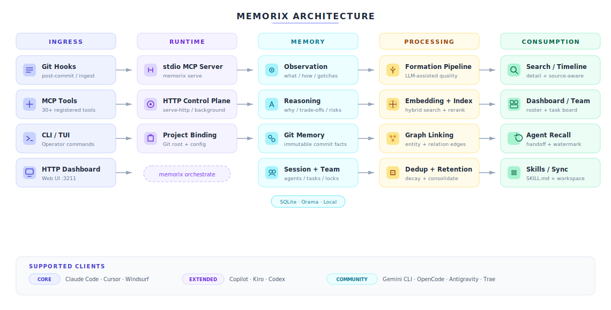

<p align="center">
  
</p>

<h1 align="center">Memorix</h1>

<p align="center">
  <strong>Open-source cross-agent memory layer for coding agents.</strong><br>
  Tiered MCP support across Cursor, Claude Code, Codex, Windsurf, Gemini CLI, GitHub Copilot, Kiro, OpenCode, Antigravity, and Trae.
</p>

<p align="center">
  <a href="https://www.npmjs.com/package/memorix"></a>
  <a href="https://www.npmjs.com/package/memorix"></a>
  <a href="LICENSE"></a>
  <a href="https://github.com/AVIDS2/memorix/actions/workflows/ci.yml"></a>
  <a href="https://github.com/AVIDS2/memorix"></a>
</p>

<p align="center">
  <strong>Three-Layer Memory</strong> | <strong>Agent Team</strong> | <strong>Workspace Sync</strong> | <strong>Multi-Agent Orchestration</strong> | <strong>Dashboard</strong>
</p>

<p align="center">
  <a href="README.zh-CN.md">Chinese</a> |
  <a href="#quick-start">Quick Start</a> |
  <a href="#docker">Docker</a> |
  <a href="#supported-clients">Supported Clients</a> |
  <a href="#common-workflows">Common Workflows</a> |
  <a href="#documentation">Documentation</a> |
  <a href="docs/SETUP.md">Setup Guide</a>
</p>

---

> Using Memorix through Cursor, Windsurf, Claude Code, Codex, or another AI coding agent? Read the [Agent Operator Playbook](docs/AGENT_OPERATOR_PLAYBOOK.md) for the agent-facing install, MCP, hook, and troubleshooting rules.

## What Is Memorix?

**Memorix is a local-first memory control plane for coding agents.**

It keeps project memory, reasoning context, Git-derived facts, and optional autonomous-agent state in one place so you can continue work across IDEs, sessions, terminals, and agent runs without losing project truth.

For most users, the default path is simple: use the local TUI/CLI or connect one IDE over stdio MCP. Treat HTTP as the shared-control-plane mode you opt into when you specifically want one long-lived background service, shared MCP access, or a live dashboard endpoint.

## Why Memorix

Most coding agents remember only the current thread. Memorix gives them a shared, persistent memory layer across IDEs, sessions, and projects.

<table>
<tr><td><b>🧠 Three-Layer Memory</b></td><td>Observation (what/how), Reasoning (why/trade-offs), Git Memory (immutable commit-derived facts with noise filtering)</td></tr>
<tr><td><b>🔍 Source-Aware Retrieval</b></td><td>"What changed" queries favor Git Memory; "why" queries favor reasoning; project-scoped by default, global on demand</td></tr>
<tr><td><b>⚙️ Memory Quality Pipeline</b></td><td>Formation (LLM-assisted evaluation), dedup, consolidation, retention with exponential decay — memory stays clean, not noisy</td></tr>
<tr><td><b>🔄 Workspace & Rules Sync</b></td><td>One command to migrate MCP configs, workflows, rules, and skills across Cursor, Windsurf, Claude Code, Codex, Copilot, Kiro, etc.</td></tr>
<tr><td><b>👥 Agent Team</b></td><td>Opt-in autonomous-agent state: task board with role-based claiming, inter-agent messaging, advisory file locks, situational-awareness poll</td></tr>
<tr><td><b>🤖 Multi-Agent Orchestration</b></td><td><code>memorix orchestrate</code> runs a structured coordination loop — plan → parallel execution → verify → fix → review — with capability routing and worktree isolation</td></tr>
<tr><td><b>📋 Session Lifecycle</b></td><td>Session start/end with handoff summaries, watermark tracking (new memories since last session), cross-session context recovery</td></tr>
<tr><td><b>🎯 Project Skills</b></td><td>Auto-generate SKILL.md from memory patterns; promote observations to permanent mini-skills injected at session start</td></tr>
<tr><td><b>📊 Dashboard</b></td><td>Local web UI for browsing memories, Git history, sessions, and read-only autonomous agent team state</td></tr>
<tr><td><b>🔒 Local & Private</b></td><td>SQLite as canonical store, Orama for search, no cloud dependency — everything stays on your machine</td></tr>
</table>

## Supported Clients

| Tier | Clients |
|------|---------|
| ★ Core | Claude Code, Cursor, Windsurf |
| ◆ Extended | GitHub Copilot, Kiro, Codex |
| ○ Community | Gemini CLI, OpenCode, Antigravity, Trae |

**Core** = full hook integration + tested MCP + rules sync. **Extended** = hook integration with platform caveats. **Community** = best-effort hooks, community-reported compatibility.

If a client can speak MCP and launch a local command or HTTP endpoint, it can usually connect to Memorix even if it is not in the list above yet.

---

## Quick Start

Install globally:

```bash
npm install -g memorix
```

Initialize Memorix config:

```bash
memorix init
```

`memorix init` lets you choose between `Global defaults` and `Project config`.

Memorix uses two files with two roles:

- `memorix.yml` for behavior and project settings
- `.env` for secrets such as API keys

Then pick the path that matches what you want to do:

| You want | Run | Best for |
| --- | --- | --- |
| Interactive terminal workbench | `memorix` | Default starting point for local search, chat, memory capture, and diagnostics |
| Quick MCP setup inside one IDE | `memorix serve` | Default MCP path for Cursor, Claude Code, Codex, Windsurf, Gemini CLI, and other stdio clients |
| Dashboard + shared HTTP MCP in the background | `memorix background start` | A long-lived shared control plane for multiple clients and a live dashboard endpoint |
| Foreground HTTP mode for debugging or a custom port | `memorix serve-http --port 3211` | Manual supervision, debugging, custom launch control |

Most users should choose **one** of the first two options above. Move to HTTP only when you intentionally want one shared background service, multi-client MCP access, or a live dashboard endpoint.

Common paths:

| Goal | Use | Why |
| --- | --- | --- |
| Work directly in the terminal | `memorix` or `memorix <command>` | CLI/TUI is the primary product surface. |
| Connect an IDE or coding agent over MCP | `memorix serve` first; HTTP + `memorix_session_start` when needed | Start a lightweight memory session without joining Agent Team by default. |
| Run autonomous multi-agent execution | `memorix orchestrate` | Structured plan → spawn → verify → fix → review loop with CLI agents. |
| Watch project memory and agent state in the browser | `memorix dashboard` | Standalone read-mostly dashboard for memory, sessions, and autonomous agent team state. |

Companion commands: `memorix background status|logs|stop`. For multi-workspace HTTP sessions, bind with `memorix_session_start(projectRoot=...)`.

Deeper details on startup, project binding, config precedence, and agent workflows: [docs/SETUP.md](docs/SETUP.md) and the [Agent Operator Playbook](docs/AGENT_OPERATOR_PLAYBOOK.md).

### TUI Workbench


Running `memorix` without arguments opens an interactive fullscreen terminal UI (requires a TTY). Use it for chat with project memory, search, quick memory capture, diagnostics, background service control, dashboard launch, and IDE setup. Press `/help` inside the TUI for the current command list.

Single-shot chat (no TUI): `memorix ask "your question"`.

### Operator CLI

Memorix exposes a **CLI-first operator surface**. Use it when you want to inspect or control the current project directly from a terminal. MCP remains the integration layer for IDEs and agents.

```bash
memorix session start --agent codex-main --agentType codex
memorix memory search --query "docker control plane"
memorix reasoning search --query "why sqlite"
memorix retention status
memorix team status
memorix task list
memorix audit project
memorix sync workspace --action scan
```

The CLI is intentionally **task-shaped**, not a 1:1 mirror of MCP tool names. Native capabilities are available through these namespaces: `session`, `memory`, `reasoning`, `retention`, `formation`, `audit`, `transfer`, `skills`, `team`, `task`, `message`, `lock`, `handoff`, `poll`, `sync`, `ingest`. MCP stays available for IDEs, agents, and optional graph-compatibility tools.

## Docker

Memorix now includes an official Docker path for the **HTTP control plane**.

Quick start:

```bash
docker compose up --build -d
```

Then connect to:

- dashboard: `http://localhost:3211`
- MCP: `http://localhost:3211/mcp`
- health: `http://localhost:3211/health`

Important: Docker support is for `serve-http`, not `memorix serve`. Project-scoped Git/config behavior only works when the container can see the repositories it is asked to bind.

Full Docker guide: [docs/DOCKER.md](docs/DOCKER.md)

Add Memorix to your MCP client:

### Generic stdio MCP config

```json
{
  "mcpServers": {
    "memorix": {
      "command": "memorix",
      "args": ["serve"]
    }
  }
}
```

### Generic HTTP MCP config

```json
{
  "mcpServers": {
    "memorix": {
      "transport": "http",
      "url": "http://localhost:3211/mcp"
    }
  }
}
```

The per-client examples below show the simplest stdio shape. If you prefer the shared HTTP control plane, keep the generic HTTP block above and use the client-specific variants in [docs/SETUP.md](docs/SETUP.md).

<details open>
<summary><strong>Cursor</strong> | <code>.cursor/mcp.json</code></summary>

```json
{
  "mcpServers": {
    "memorix": {
      "command": "memorix",
      "args": ["serve"]
    }
  }
}
```
</details>

<details>
<summary><strong>Claude Code</strong></summary>

```bash
claude mcp add memorix -- memorix serve
```
</details>

<details>
<summary><strong>Codex</strong> | <code>~/.codex/config.toml</code></summary>

```toml
[mcp_servers.memorix]
command = "memorix"
args = ["serve"]
```
</details>

For the full IDE matrix, Windows notes, and troubleshooting, see [docs/SETUP.md](docs/SETUP.md).

---

## Common Workflows

| You want to... | Use this | More detail |
| --- | --- | --- |
| Save and retrieve project memory | `memorix memory store/search/detail/resolve` or MCP `memorix_store/search/detail/resolve` | [API Reference](docs/API_REFERENCE.md#3-core-memory-tools) |
| Capture Git truth | `memorix git-hook --force`, `memorix ingest commit`, `memorix ingest log` | [Git Memory Guide](docs/GIT_MEMORY.md) |
| Run dashboard + HTTP MCP | `memorix background start` | [Setup Guide](docs/SETUP.md), [Docker](docs/DOCKER.md) |
| Keep memory-only sessions lightweight | `memorix_session_start(projectRoot=...)` or `memorix session start` | [Agent Operator Playbook](docs/AGENT_OPERATOR_PLAYBOOK.md#8-what-an-agent-should-do-at-session-start) |
| Join the autonomous agent team | `memorix session start --joinTeam` or `memorix team join` | [TEAM.md](TEAM.md), [API Reference](docs/API_REFERENCE.md#9-agent-team-tools) |
| Run autonomous multi-agent work | `memorix orchestrate --goal "..."` | [API Reference](docs/API_REFERENCE.md) |
| Sync agent configs/rules | `memorix sync workspace ...`, `memorix sync rules ...` | [Setup Guide](docs/SETUP.md) |
| Use Memorix from code | `import { createMemoryClient } from 'memorix/sdk'` | [API Reference](docs/API_REFERENCE.md) |

The most common loop is deliberately small:

```bash
memorix memory store --text "Auth tokens expire after 24h" --title "Auth token TTL" --entity auth --type decision
memorix memory search --query "auth token ttl"
memorix session start --agent codex-main --agentType codex
```

When multiple HTTP sessions are open at once, each session should bind itself with `memorix_session_start(projectRoot=...)` before using project-scoped memory tools.

HTTP MCP sessions idle out after 30 minutes by default. If your client does not automatically recover from stale HTTP session IDs, set a longer timeout before starting the control plane:

```bash
MEMORIX_SESSION_TIMEOUT_MS=86400000 memorix background start  # 24h
```

Agent Team is **not** the normal memory startup path and it is **not** a chat room between IDE windows. Join only when you need tasks, messages, locks, or a structured autonomous-agent workflow. For real multi-agent execution, prefer:

```bash
memorix orchestrate --goal "Add user authentication" --agents claude-code,cursor,codex
```

## Resource Profile

Memorix is designed to stay light during normal memory use:

- stdio MCP starts on demand and exits with the client
- HTTP background mode is one local Node process plus SQLite/Orama state
- LLM enrichment is optional; without API keys, Memorix falls back to local heuristic dedup/search
- the heavier paths are build/test, Docker image builds, dashboard browsing, large imports, and optional LLM-backed formation

On this Windows development machine, the healthy HTTP control plane was observed at about 16 MB working set after several hours idle. Treat that as a local observation, not a cross-platform guarantee. See [Performance and Resource Notes](docs/PERFORMANCE.md) for knobs and trade-offs.

## Programmatic SDK

Import Memorix directly into your own TypeScript/Node.js project — no MCP or CLI needed:

```ts
import { createMemoryClient } from 'memorix/sdk';

const client = await createMemoryClient({ projectRoot: '/path/to/repo' });

// Store a memory
await client.store({
  entityName: 'auth-module',
  type: 'decision',
  title: 'Use JWT for API auth',
  narrative: 'Chose JWT over session cookies for stateless API.',
});

// Search
const results = await client.search({ query: 'authentication' });

// Retrieve, resolve, count
const obs = await client.get(1);
const all = await client.getAll();
await client.resolve([1, 2]);

await client.close();
```

Three subpath exports:

| Import | What you get |
| --- | --- |
| `memorix/sdk` | `createMemoryClient`, `createMemorixServer`, `detectProject`, all types |
| `memorix/types` | Type-only — interfaces, enums, constants |
| `memorix` | MCP stdio entry point (not for programmatic use) |

---

## How It Works

<p align="center">
  
</p>

Memorix is not a single linear pipeline. It accepts memory from multiple ingress surfaces, persists it across multiple substrates, runs several asynchronous quality/indexing branches, and exposes the results through retrieval, dashboard, and explicit Agent Team surfaces.

### Memory Layers

- **Observation Memory**: what changed, how something works, gotchas, problem-solution notes
- **Reasoning Memory**: why a choice was made, alternatives, trade-offs, risks
- **Git Memory**: immutable engineering facts derived from commits

### Retrieval Model

- Default search is **project-scoped**
- `scope="global"` searches across projects
- Global hits can be opened explicitly with project-aware refs
- Source-aware retrieval boosts Git memories for "what changed" questions and reasoning memories for "why" questions

---

## Documentation

📖 **[Docs Map](docs/README.md)** — fastest route to the right document.

| Section | What's Covered |
| --- | --- |
| [Setup Guide](docs/SETUP.md) | Install, stdio vs HTTP control plane, per-client config |
| [Docker Deployment](docs/DOCKER.md) | Official container image path, compose, healthcheck, and path caveats |
| [Performance](docs/PERFORMANCE.md) | Resource profile, idle/runtime costs, optimization knobs |
| [Configuration](docs/CONFIGURATION.md) | `memorix.yml`, `.env`, project overrides |
| [Agent Operator Playbook](docs/AGENT_OPERATOR_PLAYBOOK.md) | Canonical AI-facing guide for installation, binding, hooks, troubleshooting |
| [Architecture](docs/ARCHITECTURE.md) | System shape, memory layers, data flows, module map |
| [API Reference](docs/API_REFERENCE.md) | MCP / HTTP / CLI command surface |
| [Git Memory Guide](docs/GIT_MEMORY.md) | Ingestion, noise filtering, retrieval semantics |
| [Development Guide](docs/DEVELOPMENT.md) | Contributor workflow, build, test, release |

Additional deep references:

- [Memory Formation Pipeline](docs/MEMORY_FORMATION_PIPELINE.md)
- [Design Decisions](docs/DESIGN_DECISIONS.md)
- [Modules](docs/MODULES.md)
- [Known Issues and Roadmap](docs/KNOWN_ISSUES_AND_ROADMAP.md)
- [AI Context Note](docs/AI_CONTEXT.md)
- [`llms.txt`](llms.txt)
- [`llms-full.txt`](llms-full.txt)

---

## What's New in 1.0.8

Version `1.0.8` builds on the 1.0.7 coordination/storage/team baseline with a CLI-first operator surface, official Docker path, dashboard refinements, and broad hooks fixes.

- **CLI-First Product Surface**: Every Memorix-native operator capability now has a task-oriented CLI route — `session`, `memory`, `reasoning`, `retention`, `formation`, `audit`, `transfer`, `skills`, `team`, `task`, `message`, `lock`, `handoff`, `poll`, `sync`, `ingest`. MCP remains the integration protocol and optional graph-compatibility layer.
- **Docker Deployment**: Official `Dockerfile`, `compose.yaml`, healthcheck, `--host` binding, and [DOCKER.md](docs/DOCKER.md) for running the HTTP control plane in a container.
- **Multi-Agent Orchestrator**: `memorix orchestrate` runs plan, parallel execution, verification, fix, review, and merge loops across Claude, Codex, Gemini CLI, and OpenCode with capability routing, worktree isolation, and agent fallback.
- **SQLite Canonical Store**: Observations, mini-skills, sessions, and archives in SQLite. Shared DB handle, freshness-safe retrieval, dead `JsonBackend` removed.
- **Opt-in Agent Team**: task board, messages, file locks, handoff artifacts, and autonomous-agent heartbeat state. `session_start` is lightweight by default; team identity is opt-in via `joinTeam` or `team_manage join`.
- **Dashboard Semantic Layering**: Team page filter tabs (Active/Recent/Historical), de-emphasized historical agents, project switcher grouped by real/temporary/placeholder, identity page cleanup.
- **Hooks Fixes**: OpenCode event-name key mapping + `Bun.spawn` → `spawnSync`; Copilot `pwsh` fallback + global-hooks guard; hook handler diagnostic logging.
- **Programmatic SDK**: `import { createMemoryClient } from 'memorix/sdk'` to store, search, get, and resolve observations directly from your own code without MCP or CLI. Also exports `createMemorixServer` and `detectProject`.
- **Test Suite Stabilization**: E2e and live-LLM tests are excluded from the default suite, and load-sensitive tests are isolated so the default verification path stays deterministic.

---

## Development

```bash
git clone https://github.com/AVIDS2/memorix.git
cd memorix
npm install

npm run dev
npm test
npm run build
```

Key local commands:

```bash
memorix status
memorix dashboard
memorix background start
memorix serve-http --port 3211
memorix git-hook --force
```

---

## Acknowledgements

Memorix builds on ideas from [mcp-memory-service](https://github.com/doobidoo/mcp-memory-service), [MemCP](https://github.com/maydali28/memcp), [claude-mem](https://github.com/anthropics/claude-code), [Mem0](https://github.com/mem0ai/mem0), and the broader MCP ecosystem.

## Star History

<a href="https://star-history.com/#AVIDS2/memorix&Date">
 <picture>
   <source media="(prefers-color-scheme: dark)" srcset="https://api.star-history.com/svg?repos=AVIDS2/memorix&type=Date&theme=dark" />
   <source media="(prefers-color-scheme: light)" srcset="https://api.star-history.com/svg?repos=AVIDS2/memorix&type=Date" />
   
 </picture>
</a>

## License

[Apache 2.0](LICENSE)
