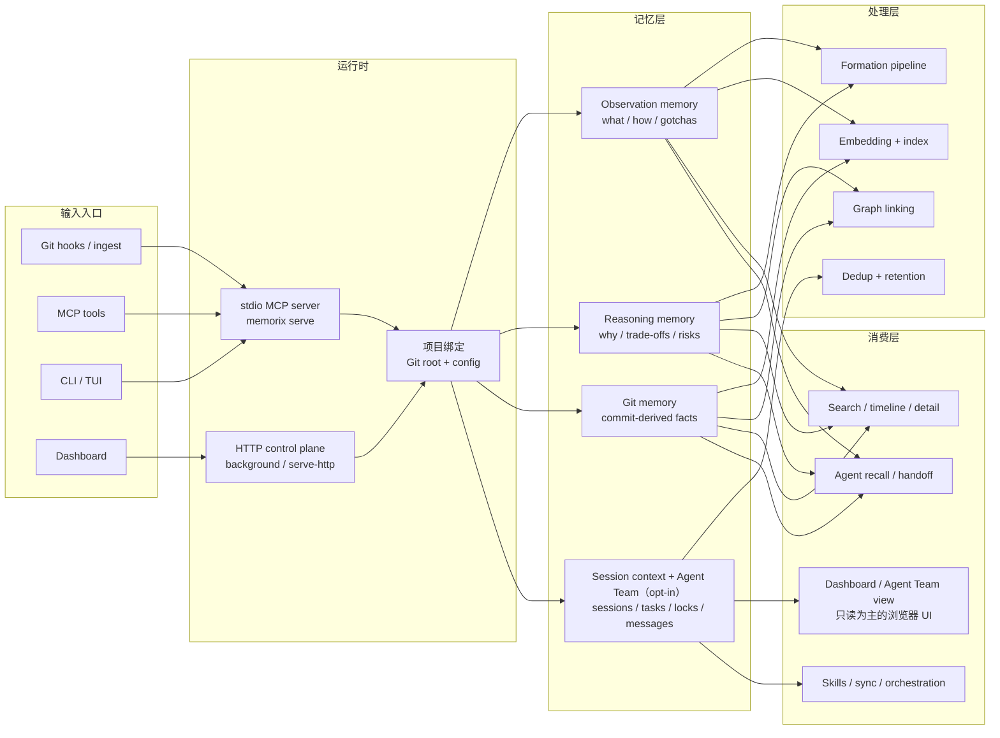

<p align="center">
  
</p>

<h1 align="center">Memorix</h1>

<p align="center">
  <strong>面向 Coding Agent 的开源记忆控制平面。</strong><br>
  CLI 优先、兼容 MCP、本地优先。<br>
  优先适配并提供分级支持的客户端包括 Cursor、Claude Code、Codex、Windsurf、Gemini CLI、GitHub Copilot、Kiro、OpenCode、Antigravity、Trae，以及其它兼容 MCP 的客户端。
</p>

<p align="center">
  <a href="https://www.npmjs.com/package/memorix"></a>
  <a href="https://www.npmjs.com/package/memorix"></a>
  <a href="LICENSE"></a>
  <a href="https://github.com/AVIDS2/memorix/actions/workflows/ci.yml"></a>
  <a href="https://github.com/AVIDS2/memorix"></a>
</p>

<p align="center">
  <strong>三层记忆</strong> | <strong>CLI 工作台</strong> | <strong>MCP 接入</strong> | <strong>自主 Agent Loop</strong> | <strong>Dashboard</strong>
</p>

<p align="center">
  <a href="README.md">English</a> |
  <a href="#快速开始">快速开始</a> |
  <a href="#为什么选择-memorix">为什么选择 Memorix</a> |
  <a href="#客户端支持">客户端支持</a> |
  <a href="#文档导航">文档导航</a> |
  <a href="docs/SETUP.md">安装指南</a>
</p>

---

> 如果你是通过 Cursor、Windsurf、Claude Code、Codex 等 coding agent 使用 Memorix，请优先阅读 [Agent Operator Playbook](docs/AGENT_OPERATOR_PLAYBOOK.md)。那份文档是面向 agent 的安装、MCP、hook 与排障手册。

## Memorix 是什么？

Memorix 是一个本地优先的 coding agent 记忆控制平面。

它把项目记忆、推理上下文、Git 导出的工程事实，以及可选的自主 Agent 协调状态放到同一套本地系统里，让你在 IDE、终端、session 和 agent run 之间继续推进同一个项目，而不会丢失项目真相。

默认路径刻意做得很轻：

- 用 `memorix` 打开终端工作台
- 用 `memorix serve` 作为单 IDE 的 stdio MCP
- 只有明确需要共享后台控制平面或 live dashboard 时，再切到 HTTP

## 为什么选择 Memorix

| 能力 | 你得到什么 |
| --- | --- |
| 三层记忆 | Observation 负责 what/how，Reasoning 负责 why，Git Memory 负责 commit 派生事实 |
| CLI 优先 | 完整 operator CLI，覆盖 session、memory、reasoning、retention、team、task、sync、ingest 等能力 |
| MCP 接入 | 支持 MCP IDE / agent，同时不把 MCP 变成唯一操作方式 |
| 本地优先 | 默认 SQLite + 本地检索，无需云端后端 |
| 自主 Agent 工作流 | 可选任务板、消息、文件锁，以及 `memorix orchestrate` 的结构化 CLI-agent loop |
| 只读 Dashboard | 本地浏览器 UI，可查看记忆、会话、Git 视图和自主 Agent 状态 |

## 快速开始

全局安装：

```bash
npm install -g memorix
```

初始化配置：

```bash
memorix init
```

然后按你的目标选择路径：

| 你想做什么 | 运行命令 | 说明 |
| --- | --- | --- |
| 打开交互式终端工作台 | `memorix` | 最推荐的默认起点 |
| 在一个 IDE 里接入 MCP | `memorix serve` | 默认 stdio MCP 路径 |
| 启动共享后台控制平面 | `memorix background start` | 可选 HTTP 模式 |
| 前台调试 HTTP | `memorix serve-http --port 3211` | 手动监督、自定义端口 |

大多数用户从 `memorix` 或 `memorix serve` 开始就够了。

通用 stdio MCP 配置：

```json
{
  "mcpServers": {
    "memorix": {
      "command": "memorix",
      "args": ["serve"]
    }
  }
}
```

HTTP MCP、Docker、按客户端配置和故障排查请直接看 [docs/SETUP.md](docs/SETUP.md)。

### TUI 工作台


直接运行 `memorix` 会打开交互式终端工作台。你可以在里面做记忆搜索、问答、快速记录、诊断、Dashboard 启动和后台服务控制。单次问答可直接用 `memorix ask "your question"`。

## 如何选择运行模式

### Stdio MCP

`memorix serve` 是默认接入模式。

适合：

- 一个 IDE 按需拉起 Memorix
- 你想要最轻量的方案
- 你不需要共享后台服务

### HTTP 控制平面

`memorix background start` 或 `memorix serve-http --port 3211` 是可选的共享控制平面模式。

适合：

- 你想维持一个长驻 Memorix 进程
- 多个客户端共享同一个 MCP 端点
- 你需要 live dashboard endpoint
- 你需要 Docker 部署

HTTP 是进阶/扩展模式，不是主要起点。

## Autonomous Agent Team

Agent Team 是面向自主 CLI-agent 工作流的协调层。

它是：

- 显式加入的
- 面向任务和工作流的
- 服务于 `memorix orchestrate`、任务、消息、文件锁、交接和 poll 的

它不是：

- 普通记忆使用的默认启动路径
- IDE 对话窗口之间的自动聊天室
- `session_start` 默认就会加入的东西

如果你要跑结构化自主执行：

```bash
memorix orchestrate --goal "Add user authentication"
```

## How It Works



## 客户端支持

| 层级 | 客户端 |
| --- | --- |
| Core | Claude Code、Cursor、Windsurf |
| Extended | GitHub Copilot、Kiro、Codex |
| Community | Gemini CLI、OpenCode、Antigravity、Trae |

Core 表示测试过的 MCP + hooks + rules sync。Extended 表示强支持但有平台 caveat。Community 表示尽力适配。

## 文档导航

建议从这里开始：

- [docs/SETUP.md](docs/SETUP.md) — 安装、stdio vs HTTP、各客户端接入
- [docs/API_REFERENCE.md](docs/API_REFERENCE.md) — CLI、MCP、session、memory、team、sync
- [docs/AGENT_OPERATOR_PLAYBOOK.md](docs/AGENT_OPERATOR_PLAYBOOK.md) — 面向 coding agent 的权威操作手册
- [docs/DOCKER.md](docs/DOCKER.md) — HTTP control plane 的 Docker 部署
- [docs/PERFORMANCE.md](docs/PERFORMANCE.md) — 资源占用和调优项
- [docs/README.md](docs/README.md) — 完整文档地图

更深入的产品与实现文档：

- [docs/ARCHITECTURE.md](docs/ARCHITECTURE.md)
- [docs/GIT_MEMORY.md](docs/GIT_MEMORY.md)
- [docs/MEMORY_FORMATION_PIPELINE.md](docs/MEMORY_FORMATION_PIPELINE.md)
- [docs/CONFIGURATION.md](docs/CONFIGURATION.md)
- [docs/DEVELOPMENT.md](docs/DEVELOPMENT.md)

## 开发

```bash
git clone https://github.com/AVIDS2/memorix.git
cd memorix
npm install
npm test
npm run build
```

## License

[Apache 2.0](LICENSE)
