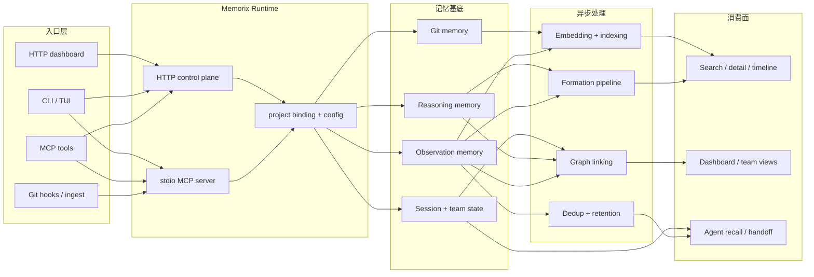

<p align="center">
  
</p>

<h1 align="center">Memorix</h1>

<p align="center">
  <strong>面向 Coding Agent 的开源跨 Agent Memory Layer。</strong><br>
  通过 MCP 兼容 Cursor、Claude Code、Codex、Windsurf、Gemini CLI、GitHub Copilot、Kiro、OpenCode、Antigravity 和 Trae。
</p>

<p align="center">
  <a href="https://www.npmjs.com/package/memorix"></a>
  <a href="https://www.npmjs.com/package/memorix"></a>
  <a href="LICENSE"></a>
  <a href="https://github.com/AVIDS2/memorix/actions/workflows/ci.yml"></a>
  <a href="https://github.com/AVIDS2/memorix"></a>
</p>

<p align="center">
  <strong>Git Memory</strong> | <strong>Reasoning Memory</strong> | <strong>跨 Agent 召回</strong> | <strong>Control Plane Dashboard</strong>
</p>

<p align="center">
  <a href="README.md">English</a> |
  <a href="#快速开始">快速开始</a> |
  <a href="#支持的客户端">支持的客户端</a> |
  <a href="#核心工作流">核心工作流</a> |
  <a href="#文档导航">文档导航</a> |
  <a href="docs/SETUP.md">安装与接入</a>
</p>

---

## 给 Coding Agent 的说明

如果你在用 AI coding agent 帮用户安装、配置或排障 Memorix，请先读 [Agent Operator Playbook](docs/AGENT_OPERATOR_PLAYBOOK.md)。

这份文档是给 agent 的正式操作手册，重点说明：

- 安装与运行模式选择
- Git 与项目绑定规则
- stdio 与 HTTP control plane 的区别
- 各 IDE / Agent 的集成和 hooks
- dot 目录按需生成策略
- 排障顺序和安全操作边界

## 为什么是 Memorix

大多数 Coding Agent 只记得当前线程。Memorix 提供的是一层共享、持久、可检索的项目记忆，让不同 IDE、不同 Agent、不同会话都能在同一套本地记忆库上继续工作。

Memorix 的几个关键差异点：

- **Git Memory**：把 `git commit` 变成可检索的工程记忆，保留提交来源、变更文件和噪音过滤结果。
- **Reasoning Memory**：不只记录“改了什么”，还记录“为什么这么做”。
- **跨 Agent 本地召回**：多个 IDE 和 Agent 可以读取同一套本地记忆，而不是各自形成孤岛。
- **记忆质量管线**：formation、压缩、保留衰减和 source-aware retrieval 协同工作，而不是一堆彼此独立的小功能。

一句话说，Memorix 解决的是：让多个 Coding Agent 通过 MCP 共享同一套耐久项目记忆，同时保留 Git 真相、推理上下文和本地控制权。

## 支持的客户端

当前已经做了明确适配的集成目标有：

- Cursor
- Claude Code
- Codex
- Windsurf
- Gemini CLI
- GitHub Copilot
- Kiro
- OpenCode
- Antigravity
- Trae

如果某个客户端能通过 MCP 连接本地命令或 HTTP 端点，通常也可以接入 Memorix，只是暂时没有单独的适配器或引导页。

---

## 快速开始

全局安装：

```bash
npm install -g memorix
```

初始化 Memorix 配置：

```bash
memorix init
```

`memorix init` 会让你在 `Global defaults` 和 `Project config` 之间选择作用域。

Memorix 使用两类文件：

- `memorix.yml`：行为配置和项目设置
- `.env`：API key 等 secrets

然后按你的目标选择一条最顺手的路径：

| 你想做什么 | 运行命令 | 适合场景 |
| --- | --- | --- |
| 先把 Memorix 快速接到一个 IDE 里 | `memorix serve` | Cursor、Claude Code、Codex、Windsurf、Gemini CLI 等 stdio MCP 客户端 |
| 在后台长期运行 HTTP MCP + Dashboard | `memorix background start` | 日常使用、多 Agent、协作、dashboard |
| 把 HTTP 模式放在前台调试或自定义端口 | `memorix serve-http --port 3211` | 调试、手动观察日志、自定义启动方式 |

对大多数用户来说，先从下面两条里选一条就够了：

- `memorix serve`：你只想尽快在 IDE 里用起来
- `memorix background start`：你想要 dashboard 和后台常驻的 HTTP control plane

可选的本地交互式界面：

```bash
memorix
```

只有在你确实想在 TTY 里直接使用本地 workbench 时，才需要运行裸命令 `memorix`。对大多数用户来说，它不是主安装路径。

配套命令：

```bash
memorix background status
memorix background logs
memorix background stop
```

如果你确实需要把 HTTP control plane 放在前台运行、做调试、手动观察日志或使用自定义端口，再用：

```bash
memorix serve-http --port 3211
```

如果你在多个工作区或多个 Agent 之间共享 HTTP control plane，请让每个 session 都在开始时调用 `memorix_session_start(projectRoot=...)`。

更细的启动根路径选择、项目绑定、配置优先级和 agent 操作说明，放在 [docs/SETUP.md](docs/SETUP.md) 和 [Agent Operator Playbook](docs/AGENT_OPERATOR_PLAYBOOK.md) 里。

把 Memorix 加进你的 MCP 客户端：

### 通用 stdio MCP 配置

```json
{
  "mcpServers": {
    "memorix": {
      "command": "memorix",
      "args": ["serve"]
    }
  }
}
```

### 通用 HTTP MCP 配置

```json
{
  "mcpServers": {
    "memorix": {
      "transport": "http",
      "url": "http://localhost:3211/mcp"
    }
  }
}
```

如果你用的是 HTTP control plane，并且会跨多个工作区或多个 Agent 共享，请确保客户端或 agent 在每个项目 session 开始时调用 `memorix_session_start(projectRoot=绝对工作区路径)`。

<details open>
<summary><strong>Cursor</strong> | <code>.cursor/mcp.json</code></summary>

```json
{
  "mcpServers": {
    "memorix": {
      "command": "memorix",
      "args": ["serve"]
    }
  }
}
```
</details>

<details>
<summary><strong>Claude Code</strong></summary>

```bash
claude mcp add memorix -- memorix serve
```
</details>

<details>
<summary><strong>Codex</strong> | <code>~/.codex/config.toml</code></summary>

```toml
[mcp_servers.memorix]
command = "memorix"
args = ["serve"]
```
</details>

完整 IDE 配置矩阵、Windows 注意事项和排障说明见 [docs/SETUP.md](docs/SETUP.md)。

---

## 核心工作流

### 1. 存储与检索项目记忆

常用 MCP 工具包括：

- `memorix_store`
- `memorix_search`
- `memorix_detail`
- `memorix_timeline`
- `memorix_resolve`

这条主链适合沉淀决策、坑点、问题修复和会话交接。

### 2. 自动捕获 Git 真相

安装 post-commit hook：

```bash
memorix git-hook --force
```

或者手动导入：

```bash
memorix ingest commit
memorix ingest log --count 20
```

Git Memory 会保留 `source='git'`、提交哈希、文件变更和噪音过滤结果。

### 3. 运行控制面与 Dashboard

```bash
memorix background start
```

然后访问：

- MCP HTTP 端点：`http://localhost:3211/mcp`
- Dashboard：`http://localhost:3211`

配套命令：

```bash
memorix background status
memorix background logs
memorix background stop
```

如果你需要把控制面放在前台做调试或手动观察，也可以使用：

```bash
memorix serve-http --port 3211
```

这一模式会把 dashboard、配置诊断、项目身份、团队协作和 Git Memory 视图统一到一个控制面入口里。

当多个 HTTP session 同时存在时，每个 session 都应先用 `memorix_session_start(projectRoot=...)` 显式绑定当前工作区，再去调用项目级记忆工具。

---

## 工作原理



Memorix 不是一条单线流水线。它从多个入口接收记忆，把内容落到多种记忆基底上，经过异步质量与索引处理，再通过不同的检索和协作界面提供给用户与 agent。

### 记忆层

- **Observation Memory**：记录“改了什么 / 系统怎么工作 / 踩过什么坑”
- **Reasoning Memory**：记录“为什么这么做 / 替代方案 / 权衡 / 风险”
- **Git Memory**：记录从提交中提炼出的工程事实

### 检索模型

- 默认搜索是**当前项目作用域**
- `scope="global"` 可以跨项目搜索
- 全局结果可通过带项目信息的 ref 再展开
- source-aware retrieval 会对“发生了什么”问题偏向 Git Memory，对“为什么”问题偏向 reasoning memory

---

## 文档导航

### 入门

- [Setup Guide](docs/SETUP.md)
- [Configuration Guide](docs/CONFIGURATION.md)

### 产品与架构

- [Architecture](docs/ARCHITECTURE.md)
- [Memory Formation Pipeline](docs/MEMORY_FORMATION_PIPELINE.md)
- [Design Decisions](docs/DESIGN_DECISIONS.md)

### 参考资料

- [API Reference](docs/API_REFERENCE.md)
- [Git Memory Guide](docs/GIT_MEMORY.md)
- [Modules](docs/MODULES.md)

### 开发

- [Development Guide](docs/DEVELOPMENT.md)
- [Known Issues and Roadmap](docs/KNOWN_ISSUES_AND_ROADMAP.md)

### AI / Agent 文档

- [Agent Operator Playbook](docs/AGENT_OPERATOR_PLAYBOOK.md)
- [AI Context Note](docs/AI_CONTEXT.md)
- [`llms.txt`](llms.txt)
- [`llms-full.txt`](llms-full.txt)

---

## 开发

```bash
git clone https://github.com/AVIDS2/memorix.git
cd memorix
npm install

npm run dev
npm test
npm run build
```

常用本地命令：

```bash
memorix status
memorix dashboard
memorix background start
memorix serve-http --port 3211
memorix git-hook --force
```

---

## 鸣谢

Memorix 借鉴了 [mcp-memory-service](https://github.com/doobidoo/mcp-memory-service)、[MemCP](https://github.com/maydali28/memcp)、[claude-mem](https://github.com/anthropics/claude-code)、[Mem0](https://github.com/mem0ai/mem0) 和整个 MCP 生态中的许多思路。

## Star 历史

<a href="https://star-history.com/#AVIDS2/memorix&Date">
 <picture>
   <source media="(prefers-color-scheme: dark)" srcset="https://api.star-history.com/svg?repos=AVIDS2/memorix&type=Date&theme=dark" />
   <source media="(prefers-color-scheme: light)" srcset="https://api.star-history.com/svg?repos=AVIDS2/memorix&type=Date" />
   
 </picture>
</a>

## License

[Apache 2.0](LICENSE)
