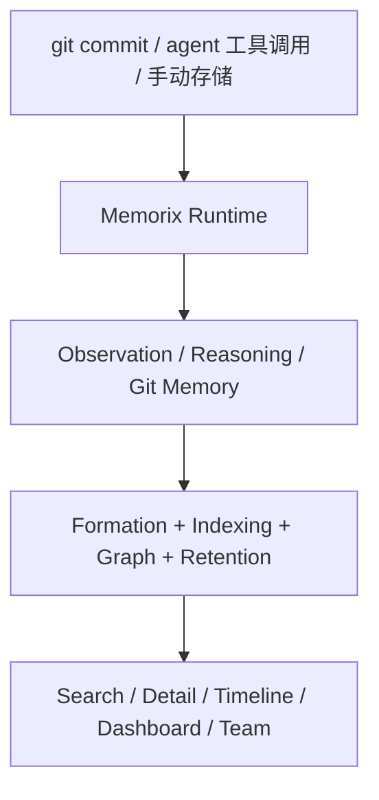

<p align="center">
  
</p>

<h1 align="center">Memorix</h1>

<p align="center">
  <strong>面向 AI 编码 Agent 的本地优先记忆平台。</strong><br>
  将 Git 真相、推理记忆和跨 Agent 召回统一到一个 MCP 服务器中。
</p>

<p align="center">
  <a href="https://www.npmjs.com/package/memorix"></a>
  <a href="https://www.npmjs.com/package/memorix"></a>
  <a href="LICENSE"></a>
  <a href="https://github.com/AVIDS2/memorix/actions/workflows/ci.yml"></a>
  <a href="https://github.com/AVIDS2/memorix"></a>
</p>

<p align="center">
  <strong>Git Memory</strong> · <strong>Reasoning Memory</strong> · <strong>跨 Agent 召回</strong> · <strong>控制台仪表盘</strong>
</p>

<p align="center">
  <a href="README.md">English</a> ·
  <a href="#快速开始">快速开始</a> ·
  <a href="#工作原理">工作原理</a> ·
  <a href="#文档导航">文档导航</a> ·
  <a href="docs/SETUP.md">配置指南</a>
</p>

---

## 为什么是 Memorix

大多数 AI 编码 Agent 只能记住当前对话。Memorix 提供跨 IDE、跨会话、跨 Agent 的共享持久化记忆层，让工程上下文真正沉淀下来。

Memorix 的差异化主要在这几条线：

- **Git Memory**：把 `git commit` 转成带来源、可检索、可过滤噪音的工程记忆。
- **Reasoning Memory**：不仅记录“改了什么”，还能记录“为什么这样做”。
- **跨 Agent 本地召回**：Cursor、Windsurf、Claude Code、Codex、Copilot、Kiro、OpenCode、Gemini CLI 等都可以读写同一套本地记忆。
- **质量治理管线**：Formation、写入压缩、保留衰减、source-aware retrieval 协同工作，而不是一堆孤立工具。

---

## 快速开始

全局安装：

```bash
npm install -g memorix
```

初始化项目配置：

```bash
memorix init
```

Memorix 采用“两类文件、两种职责”：

- `memorix.yml`：行为配置、项目策略
- `.env`：密钥和敏感端点

选择一种运行模式：

```bash
memorix serve
```

`serve` 用于标准的 stdio MCP 集成。

```bash
memorix serve-http --port 3211
```

`serve-http` 用于 HTTP transport、团队协作，以及与之共端口的 dashboard。

把 Memorix 加入 MCP 配置：

<details open>
<summary><strong>Cursor</strong> · <code>.cursor/mcp.json</code></summary>

```json
{
  "mcpServers": {
    "memorix": {
      "command": "memorix",
      "args": ["serve"]
    }
  }
}
```
</details>

<details>
<summary><strong>Claude Code</strong></summary>

```bash
claude mcp add memorix -- memorix serve
```
</details>

<details>
<summary><strong>Codex</strong> · <code>~/.codex/config.toml</code></summary>

```toml
[mcp_servers.memorix]
command = "memorix"
args = ["serve"]
```
</details>

完整 IDE 配置矩阵、Windows 注意事项和排障请看 [docs/SETUP.md](docs/SETUP.md)。

---

## 核心工作流

### 1. 存储并检索项目记忆

常用 MCP 工具包括：

- `memorix_store`
- `memorix_search`
- `memorix_detail`
- `memorix_timeline`
- `memorix_resolve`

这条主链适合沉淀决策、踩坑、问题修复、会话交接等上下文。

### 2. 自动捕获 Git 工程真相

安装 post-commit hook：

```bash
memorix git-hook --force
```

也可以手动导入：

```bash
memorix ingest commit
memorix ingest log --count 20
```

Git Memory 会带上 `source='git'`、commit hash、文件列表，以及噪音过滤结果。

### 3. 运行控制台与协作入口

```bash
memorix serve-http --port 3211
```

然后访问：

- MCP HTTP 端点：`http://localhost:3211/mcp`
- Dashboard：`http://localhost:3211`

这个模式会把 dashboard、团队协作、配置诊断、项目身份健康度等能力统一到同一个入口。

---

## 工作原理



### 三层记忆模型

- **Observation Memory**：记录 what-changed、how-it-works、gotcha、problem-solution 等工程知识
- **Reasoning Memory**：记录决策理由、备选方案、权衡、风险
- **Git Memory**：从 commit 提取的不可变工程事实

### 检索模型

- 默认搜索是**当前项目隔离**
- `scope="global"` 才会跨项目搜索
- 全局结果可通过带 `projectId` 的 refs 精确打开详情
- source-aware retrieval 会根据问题类型动态提升 Git 或 reasoning memory 的权重

---

## 文档导航

### 上手与配置

- [Setup Guide](docs/SETUP.md)
- [Configuration Guide](docs/CONFIGURATION.md)

### 产品与架构

- [Architecture](docs/ARCHITECTURE.md)
- [Memory Formation Pipeline](docs/MEMORY_FORMATION_PIPELINE.md)
- [Design Decisions](docs/DESIGN_DECISIONS.md)

### 参考文档

- [API Reference](docs/API_REFERENCE.md)
- [Git Memory Guide](docs/GIT_MEMORY.md)
- [Modules](docs/MODULES.md)

### 开发

- [Development Guide](docs/DEVELOPMENT.md)
- [Known Issues and Roadmap](docs/KNOWN_ISSUES_AND_ROADMAP.md)

### 面向 AI 的项目文档

- [`llms.txt`](llms.txt)
- [`llms-full.txt`](llms-full.txt)

---

## 开发

```bash
git clone https://github.com/AVIDS2/memorix.git
cd memorix
npm install

npm run dev
npm test
npm run build
```

常用本地命令：

```bash
memorix status
memorix dashboard
memorix serve-http --port 3211
memorix git-hook --force
```

---

## 致谢

Memorix 借鉴了 [mcp-memory-service](https://github.com/doobidoo/mcp-memory-service)、[MemCP](https://github.com/maydali28/memcp)、[claude-mem](https://github.com/anthropics/claude-code)、[Mem0](https://github.com/mem0ai/mem0) 以及更广义 MCP 生态中的许多思路。

## Star History

<a href="https://star-history.com/#AVIDS2/memorix&Date">
 <picture>
   <source media="(prefers-color-scheme: dark)" srcset="https://api.star-history.com/svg?repos=AVIDS2/memorix&type=Date&theme=dark" />
   <source media="(prefers-color-scheme: light)" srcset="https://api.star-history.com/svg?repos=AVIDS2/memorix&type=Date" />
   
 </picture>
</a>

## License

[Apache 2.0](LICENSE)
