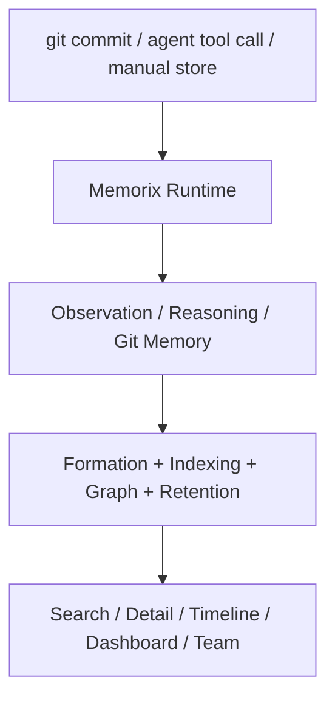

<p align="center">
  
</p>

<h1 align="center">Memorix</h1>

<p align="center">
  <strong>面向 Coding Agent 的开源跨 Agent Memory Layer。</strong><br>
  通过 MCP 兼容 Cursor、Claude Code、Codex、Windsurf、Gemini CLI、GitHub Copilot、Kiro、OpenCode、Antigravity 和 Trae。
</p>

<p align="center">
  <a href="https://www.npmjs.com/package/memorix"></a>
  <a href="https://www.npmjs.com/package/memorix"></a>
  <a href="LICENSE"></a>
  <a href="https://github.com/AVIDS2/memorix/actions/workflows/ci.yml"></a>
  <a href="https://github.com/AVIDS2/memorix"></a>
</p>

<p align="center">
  <strong>Git Memory</strong> | <strong>Reasoning Memory</strong> | <strong>跨 Agent 召回</strong> | <strong>控制面 Dashboard</strong>
</p>

<p align="center">
  <a href="README.md">English</a> |
  <a href="#快速开始">快速开始</a> |
  <a href="#支持的客户端">支持的客户端</a> |
  <a href="#核心工作流">核心工作流</a> |
  <a href="#文档导航">文档导航</a> |
  <a href="docs/SETUP.md">安装与接入</a>
</p>

---

## 为什么是 Memorix

大多数 Coding Agent 只能记住当前线程。Memorix 的目标是把“项目记忆”沉淀成一个共享、可检索、可跨 IDE 和 Agent 复用的本地记忆层。

Memorix 的差异化重点在于：

- **Git Memory**：把 `git commit` 变成可检索的工程记忆，保留提交来源、文件变化和噪音过滤。
- **Reasoning Memory**：不仅记“改了什么”，还记“为什么这样做”。
- **跨 Agent 本地召回**：多个 IDE 和 Agent 可以读取同一套本地记忆，而不是各自形成孤岛。
- **记忆质量管线**：formation、压缩、保留衰减和 source-aware retrieval 协同工作，而不是一堆彼此独立的小功能。

一句话说，Memorix 想解决的是：让多个 Coding Agent 通过 MCP 共享同一套耐久项目记忆，同时保留 Git 真相、推理上下文和本地控制权。

## 支持的客户端

当前已经做了明确适配的集成目标有：

- Cursor
- Claude Code
- Codex
- Windsurf
- Gemini CLI
- GitHub Copilot
- Kiro
- OpenCode
- Antigravity
- Trae

如果某个客户端能通过 MCP 连接本地命令或 HTTP 端点，通常也可以接入 Memorix，只是暂时没有单独的适配器或引导页。

---

## 快速开始

全局安装：

```bash
npm install -g memorix
```

初始化项目配置：

```bash
memorix init
```

Memorix 采用两个文件、两类职责：

- `memorix.yml`：行为配置和项目级设置
- `.env`：密钥和敏感变量

然后选择一种运行模式：

```bash
memorix serve
```

`serve` 适合标准的 stdio MCP 集成。

```bash
memorix serve-http --port 3211
```

`serve-http` 适合你需要 HTTP transport、dashboard、协作和控制面的场景。

在 HTTP control-plane 模式下，如果 Agent 能拿到当前工作区绝对路径，就应该在调用 `memorix_session_start` 时把它作为 `projectRoot` 传入。`projectRoot` 只是检测锚点，最终项目身份仍然以 Git 为准。

把 Memorix 加入 MCP 配置：

<details open>
<summary><strong>Cursor</strong> | <code>.cursor/mcp.json</code></summary>

```json
{
  "mcpServers": {
    "memorix": {
      "command": "memorix",
      "args": ["serve"]
    }
  }
}
```
</details>

<details>
<summary><strong>Claude Code</strong></summary>

```bash
claude mcp add memorix -- memorix serve
```
</details>

<details>
<summary><strong>Codex</strong> | <code>~/.codex/config.toml</code></summary>

```toml
[mcp_servers.memorix]
command = "memorix"
args = ["serve"]
```
</details>

完整的 IDE 配置矩阵、Windows 注意事项和排障说明见 [docs/SETUP.md](docs/SETUP.md)。

---

## 核心工作流

### 1. 存储与检索项目记忆

常用 MCP 工具包括：

- `memorix_store`
- `memorix_search`
- `memorix_detail`
- `memorix_timeline`
- `memorix_resolve`

这条主链适合沉淀决策、坑点、问题修复和会话交接。

### 2. 自动捕获 Git 真相

安装 post-commit hook：

```bash
memorix git-hook --force
```

或者手动导入：

```bash
memorix ingest commit
memorix ingest log --count 20
```

Git Memory 会保留 `source='git'`、提交哈希、文件变化和噪音过滤结果。

### 3. 运行控制面与 Dashboard

```bash
memorix serve-http --port 3211
```

然后访问：

- MCP HTTP 端点：`http://localhost:3211/mcp`
- Dashboard：`http://localhost:3211`

这一模式会把 dashboard、配置诊断、项目身份、团队协作和 Git Memory 视图统一到一个控制面入口里。

---

## 工作原理



### 三层记忆模型

- **Observation Memory**：记录 what-changed、how-it-works、gotcha、problem-solution 等工程知识
- **Reasoning Memory**：记录为什么这样做、比较过哪些方案、接受了什么权衡
- **Git Memory**：从 commit 中提炼的工程真相层

### 检索模型

- 默认搜索是 **当前项目隔离**
- `scope="global"` 才会跨项目检索
- 全局结果可以通过带 `projectId` 的 refs 精确打开详情
- source-aware retrieval 会根据问题类型动态提升 Git 或 reasoning memory 的权重

---

## 文档导航

### 上手与配置

- [Setup Guide](docs/SETUP.md)
- [Configuration Guide](docs/CONFIGURATION.md)

### 产品与架构

- [Architecture](docs/ARCHITECTURE.md)
- [Memory Formation Pipeline](docs/MEMORY_FORMATION_PIPELINE.md)
- [Design Decisions](docs/DESIGN_DECISIONS.md)

### 参考资料

- [API Reference](docs/API_REFERENCE.md)
- [Git Memory Guide](docs/GIT_MEMORY.md)
- [Modules](docs/MODULES.md)

### 开发

- [Development Guide](docs/DEVELOPMENT.md)
- [Known Issues and Roadmap](docs/KNOWN_ISSUES_AND_ROADMAP.md)

### 面向 AI 的项目文档

- [`llms.txt`](llms.txt)
- [`llms-full.txt`](llms-full.txt)

---

## 本地开发

```bash
git clone https://github.com/AVIDS2/memorix.git
cd memorix
npm install

npm run dev
npm test
npm run build
```

常用本地命令：

```bash
memorix status
memorix dashboard
memorix serve-http --port 3211
memorix git-hook --force
```

---

## 致谢

Memorix 借鉴了 [mcp-memory-service](https://github.com/doobidoo/mcp-memory-service)、[MemCP](https://github.com/maydali28/memcp)、[claude-mem](https://github.com/anthropics/claude-code)、[Mem0](https://github.com/mem0ai/mem0) 以及更广义 MCP 生态中的许多思路。

## Star History

<a href="https://star-history.com/#AVIDS2/memorix&Date">
 <picture>
   <source media="(prefers-color-scheme: dark)" srcset="https://api.star-history.com/svg?repos=AVIDS2/memorix&type=Date&theme=dark" />
   <source media="(prefers-color-scheme: light)" srcset="https://api.star-history.com/svg?repos=AVIDS2/memorix&type=Date" />
   
 </picture>
</a>

## License

[Apache 2.0](LICENSE)
