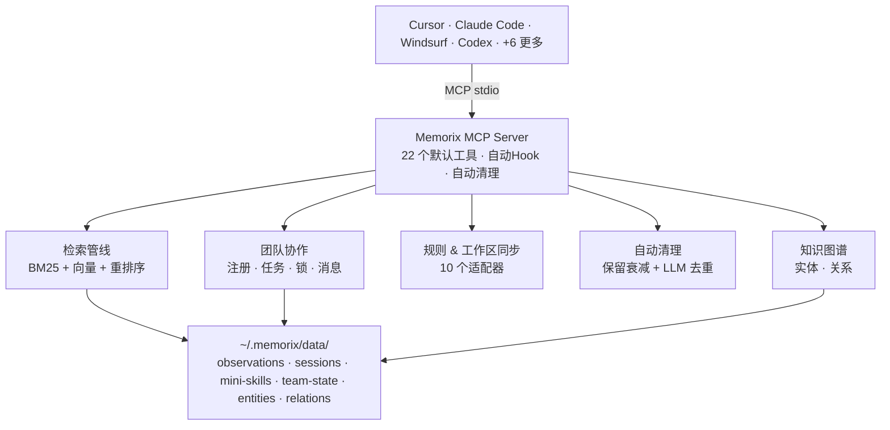

<p align="center">
  
</p>

<h1 align="center">Memorix</h1>

<p align="center">
  <strong>AI 编码 Agent 的持久化记忆层</strong><br>
  一个 MCP 服务器，十个 Agent，零上下文丢失。
</p>

<p align="center">
  <a href="https://www.npmjs.com/package/memorix"></a>
  <a href="https://www.npmjs.com/package/memorix"></a>
  <a href="LICENSE"></a>
  <a href="https://github.com/AVIDS2/memorix"></a>
  
</p>

<p align="center">
  <strong>v1.0 正式版 | 22 个 MCP 工具 | 自动清理 | 多 Agent 协作 | 10 IDE 支持</strong>
</p>

<p align="center">
  
  
  
  
  
  
  
  
  
  
</p>

<p align="center">
  <a href="README.md">English</a> ·
  <a href="#快速开始">快速开始</a> ·
  <a href="#功能">功能</a> ·
  <a href="#架构">架构</a> ·
  <a href="docs/SETUP.md">配置指南</a>
</p>

---

## 简介

AI 编码 Agent 在会话之间会丢失全部上下文。切换 IDE 后，之前的决策、调试历史和架构知识全部消失。Memorix 提供跨 Agent、跨会话的共享持久化记忆层——存储决策、踩坑经验和项目知识，任何 Agent 都可以即时检索。

```
会话 1（Cursor）：      "用 JWT + refresh token，15 分钟过期"  → 存储为 decision
会话 2（Claude Code）： "添加登录接口"  → 检索到该决策 → 正确实现
```

无需重复解释。无需复制粘贴。无厂商锁定。

### 核心能力

- **跨 Agent 记忆共享**：所有 Agent 共用同一记忆存储。在 Cursor 中存储，在 Claude Code 中检索。
- **多 Agent 协作**：Team 工具支持 Agent 间协调——注册/注销、文件锁、任务板、跨 IDE 消息传递，通过共享的 `team-state.json` 实现。
- **启动自动清理**：后台自动归档过期记忆 + 智能去重（配有 LLM 时用语义分析，否则用启发式），零人工维护。
- **双模式质量引擎**：免费启发式引擎处理基础去重；可选 LLM 模式提供智能压缩、重排序和冲突检测。
- **3 层渐进式展示**：搜索返回紧凑索引（每条约 50 tokens），时间线展示前后文，详情提供完整内容。相比全文检索节省约 10 倍 token。
- **Mini-Skills**：将高价值观察提升为永久技能，每次会话启动自动注入。关键知识永不衰减。
- **自动记忆 Hook**：自动从 IDE 工具调用中捕获决策、错误和踩坑经验。支持中英文模式检测。
- **知识图谱**：实体-关系模型，兼容 [MCP 官方 Memory Server](https://github.com/modelcontextprotocol/servers/tree/main/src/memory)。自动从内容中提取实体并创建关联。

---

## 快速开始

```bash
npm install -g memorix
```

添加到 Agent 的 MCP 配置：

<details open>
<summary><strong>Cursor</strong> · <code>.cursor/mcp.json</code></summary>

```json
{ "mcpServers": { "memorix": { "command": "memorix", "args": ["serve"] } } }
```
</details>

<details>
<summary><strong>Claude Code</strong></summary>

```bash
claude mcp add memorix -- memorix serve
```
</details>

<details>
<summary><strong>Windsurf</strong> · <code>~/.codeium/windsurf/mcp_config.json</code></summary>

```json
{ "mcpServers": { "memorix": { "command": "memorix", "args": ["serve"] } } }
```
</details>

<details>
<summary><strong>VS Code Copilot</strong> · <code>.vscode/mcp.json</code></summary>

```json
{ "servers": { "memorix": { "command": "memorix", "args": ["serve"] } } }
```
</details>

<details>
<summary><strong>Codex</strong> · <code>~/.codex/config.toml</code></summary>

```toml
[mcp_servers.memorix]
command = "memorix"
args = ["serve"]
```
</details>

<details>
<summary><strong>Kiro</strong> · <code>.kiro/settings/mcp.json</code></summary>

```json
{ "mcpServers": { "memorix": { "command": "memorix", "args": ["serve"] } } }
```
</details>

<details>
<summary><strong>Antigravity</strong> · <code>~/.gemini/antigravity/mcp_config.json</code></summary>

```json
{ "mcpServers": { "memorix": { "command": "memorix", "args": ["serve"], "env": { "MEMORIX_PROJECT_ROOT": "/your/project/path" } } } }
```
</details>

<details>
<summary><strong>OpenCode</strong> · <code>~/.config/opencode/config.json</code></summary>

```json
{ "mcpServers": { "memorix": { "command": "memorix", "args": ["serve"] } } }
```
</details>

<details>
<summary><strong>Trae</strong> · <code>~/%APPDATA%/Trae/User/mcp.json</code></summary>

```json
{ "mcpServers": { "memorix": { "command": "memorix", "args": ["serve"] } } }
```
</details>

<details>
<summary><strong>Gemini CLI</strong> · <code>.gemini/settings.json</code></summary>

```json
{ "mcpServers": { "memorix": { "command": "memorix", "args": ["serve"] } } }
```
</details>

重启 Agent 即可。无需 API Key，无需云服务，无需额外依赖。

> **自动更新**：Memorix 启动时静默检查更新（每 24 小时一次），有新版本自动后台安装。

> **注意**：不要用 `npx`——它每次都会重新下载，导致 MCP 超时。请用全局安装。
>
> [完整配置指南](docs/SETUP.md) · [常见问题排查](docs/SETUP.md#troubleshooting)

---

## 功能

### 22 个 MCP 工具（默认）

| 分类 | 工具 |
|------|------|
| **记忆** | `memorix_store` · `memorix_search` · `memorix_detail` · `memorix_timeline` · `memorix_resolve` · `memorix_deduplicate` · `memorix_suggest_topic_key` |
| **会话** | `memorix_session_start` · `memorix_session_end` · `memorix_session_context` |
| **技能** | `memorix_skills` · `memorix_promote` |
| **工作区** | `memorix_workspace_sync` · `memorix_rules_sync` |
| **维护** | `memorix_retention` · `memorix_consolidate` · `memorix_transfer` |
| **团队** | `team_manage` · `team_file_lock` · `team_task` · `team_message` |
| **仪表盘** | `memorix_dashboard` |

<details>
<summary><strong>+9 可选：知识图谱工具</strong>（在 <code>~/.memorix/settings.json</code> 中启用）</summary>

`create_entities` · `create_relations` · `add_observations` · `delete_entities` · `delete_observations` · `delete_relations` · `search_nodes` · `open_nodes` · `read_graph`

启用方式：`{ "knowledgeGraph": true }` 写入 `~/.memorix/settings.json`
</details>

### 观察类型

九种结构化类型用于分类存储的知识：

`session-request` · `gotcha` · `problem-solution` · `how-it-works` · `what-changed` · `discovery` · `why-it-exists` · `decision` · `trade-off`

### 混合搜索

BM25 全文搜索开箱即用，资源占用极低（~50MB RAM）。语义向量搜索为可选项，提供三种接入方式：

| 方式 | 配置 | 资源消耗 | 质量 |
|------|------|---------|------|
| **API**（推荐） | `MEMORIX_EMBEDDING=api` | 零本地 RAM | 最高 |
| **fastembed** | `MEMORIX_EMBEDDING=fastembed` | ~300MB RAM | 高 |
| **transformers** | `MEMORIX_EMBEDDING=transformers` | ~500MB RAM | 高 |
| **关闭**（默认） | `MEMORIX_EMBEDDING=off` | ~50MB RAM | 仅 BM25 |

API Embedding 兼容任何 OpenAI 格式的接口——OpenAI、通义千问/DashScope、OpenRouter、Ollama 或任何代理：

```bash
MEMORIX_EMBEDDING=api
MEMORIX_EMBEDDING_API_KEY=sk-xxx
MEMORIX_EMBEDDING_MODEL=text-embedding-3-small
MEMORIX_EMBEDDING_BASE_URL=https://api.openai.com/v1    # 可选
MEMORIX_EMBEDDING_DIMENSIONS=512                         # 可选
```

Embedding 基础设施包含 10K LRU 缓存及磁盘持久化、批量 API 调用（单次最多 2048 条文本）、并行处理（4 个并发分块）以及文本归一化以提升缓存命中率。零外部依赖——不需要 Chroma，不需要 SQLite。

本地 Embedding：

```bash
npm install -g fastembed                     # ONNX 运行时
npm install -g @huggingface/transformers     # JS/WASM 运行时
```

### LLM 增强模式

可选的 LLM 集成，显著提升记忆质量。在基础搜索之上叠加三项能力：

| 能力 | 说明 | 实测效果 |
|------|------|---------|
| **叙述压缩** | 存储前压缩冗余观察，保留所有技术事实 | 降低 27% token 消耗（叙述性内容最高 44%） |
| **搜索重排序** | LLM 按语义相关性对搜索结果重新排序 | 60% 查询改善，0% 恶化 |
| **写入时去重** | 写入时检测重复和冲突；自动合并、更新或跳过 | 防止冗余存储，解决矛盾 |

智能过滤确保 LLM 仅在有意义时被调用——命令、文件路径等结构化内容自动跳过。

```bash
MEMORIX_LLM_API_KEY=sk-xxx
MEMORIX_LLM_PROVIDER=openai          # openai | anthropic | openrouter | custom
MEMORIX_LLM_MODEL=gpt-4.1-nano       # 任何聊天补全模型
MEMORIX_LLM_BASE_URL=https://...     # 自定义端点（可选）
```

Memorix 自动检测已有环境变量：

| 变量 | 提供商 |
|------|--------|
| `OPENAI_API_KEY` | OpenAI |
| `ANTHROPIC_API_KEY` | Anthropic |
| `OPENROUTER_API_KEY` | OpenRouter |

**无 LLM**：免费启发式去重（基于相似度规则）。**有 LLM**：智能压缩、上下文重排序、矛盾检测和事实提取。

> **Embedding vs LLM**：Embedding 用于语义搜索（文本向量化），LLM 用于智能管理（理解文本含义）。两者独立配置，均为可选。

### Mini-Skills

使用 `memorix_promote` 将高价值观察提升为永久技能。Mini-Skills 的特性：

- **永久保留** — 不受衰减机制影响，永不归档
- **自动注入** — 每次 `memorix_session_start` 时自动加载到上下文
- **项目隔离** — 按项目独立存储，无跨项目污染

适用于必须永久保留的关键知识：部署流程、架构约束、反复出现的坑。

### 团队协作

多个 Agent 在同一工作区可通过 4 个团队工具协调：

| 工具 | 操作 | 用途 |
|------|------|------|
| `team_manage` | join, leave, status | Agent 注册——查看谁在线 |
| `team_file_lock` | lock, unlock, status | 协商式文件锁防止冲突 |
| `team_task` | create, claim, complete, list | 共享任务板+依赖管理 |
| `team_message` | send, broadcast, inbox | 直接消息和广播 |

状态持久化到 `team-state.json`，所有 IDE 进程共享。详见 [TEAM.md](TEAM.md)。

### 自动记忆 Hook

```bash
memorix hooks install
```

自动从 IDE 工具调用中捕获决策、错误和踩坑经验。支持中英文模式检测。智能过滤（30 秒冷却，跳过无关命令）。高价值记忆在会话启动时自动注入。

### 交互式 CLI

```bash
memorix              # 交互菜单
memorix configure    # LLM + Embedding 配置向导
memorix status       # 项目信息与统计
memorix dashboard    # Web UI（localhost:3210）
memorix hooks install # 为 IDE 安装自动记忆
```

---

## 架构



### 检索管线

三阶段检索，渐进式质量提升：

```
阶段 1:  Orama (BM25 + 向量混合)  →  Top-N 候选
阶段 2:  LLM 重排序（可选）       →  按语义相关性重新排序
阶段 3:  时间衰减 + 项目亲和度    →  最终评分结果
```

### 写入管线

```
输入  →  LLM 压缩（可选）  →  写入时去重/合并  →  存储 + 索引
```

### 关键设计决策

- **项目隔离**：通过 `git remote` 自动检测，默认按项目搜索。
- **共享存储**：所有 Agent 读写 `~/.memorix/data/`，天然跨 IDE。
- **Token 效率**：3 层渐进式展示（search、timeline、detail），节省约 10 倍。
- **优雅降级**：所有 LLM 和 Embedding 功能均为可选。核心功能零配置即可使用。

---

## 开发

```bash
git clone https://github.com/AVIDS2/memorix.git
cd memorix && npm install

npm run dev       # 监听模式
npm test          # 753 个测试
npm run build     # 生产构建
```

[架构设计](docs/ARCHITECTURE.md) · [API 参考](docs/API_REFERENCE.md) · [模块说明](docs/MODULES.md) · [设计决策](docs/DESIGN_DECISIONS.md)

> AI 系统参考：[`llms.txt`](llms.txt) · [`llms-full.txt`](llms-full.txt)

---

## 致谢

参考了 [mcp-memory-service](https://github.com/doobidoo/mcp-memory-service)、[MemCP](https://github.com/maydali28/memcp)、[claude-mem](https://github.com/anthropics/claude-code) 和 [Mem0](https://github.com/mem0ai/mem0) 的设计思路。

## Star History

<a href="https://star-history.com/#AVIDS2/memorix&Date">
 <picture>
   <source media="(prefers-color-scheme: dark)" srcset="https://api.star-history.com/svg?repos=AVIDS2/memorix&type=Date&theme=dark" />
   <source media="(prefers-color-scheme: light)" srcset="https://api.star-history.com/svg?repos=AVIDS2/memorix&type=Date" />
   
 </picture>
</a>

## License

[Apache 2.0](LICENSE)
