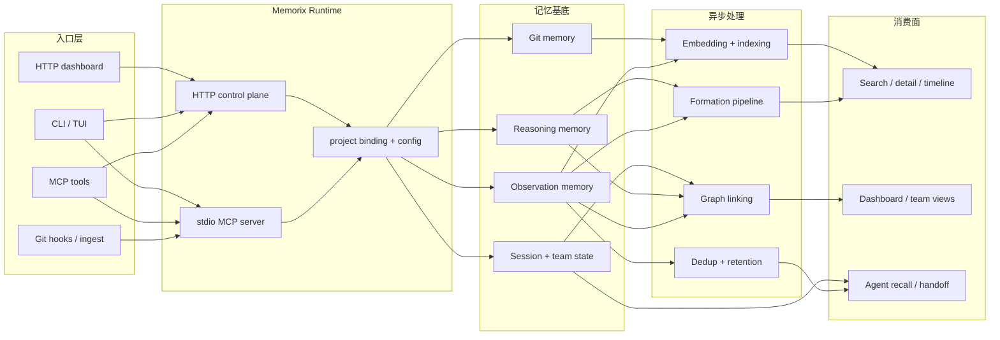

<p align="center">
  
</p>

<h1 align="center">Memorix</h1>

<p align="center">
  <strong>面向 Coding Agent 的开源跨 Agent Memory Layer。</strong><br>
  通过 MCP 为 Cursor、Claude Code、Codex、Windsurf、Gemini CLI、GitHub Copilot、Kiro、OpenCode、Antigravity 和 Trae 提供分级支持。
</p>

<p align="center">
  <a href="https://www.npmjs.com/package/memorix"></a>
  <a href="https://www.npmjs.com/package/memorix"></a>
  <a href="LICENSE"></a>
  <a href="https://github.com/AVIDS2/memorix/actions/workflows/ci.yml"></a>
  <a href="https://github.com/AVIDS2/memorix"></a>
</p>

<p align="center">
  <strong>Git Memory</strong> | <strong>Reasoning Memory</strong> | <strong>跨 Agent 召回</strong> | <strong>Control Plane Dashboard</strong>
</p>

<p align="center">
  <a href="README.md">English</a> |
  <a href="#快速开始">快速开始</a> |
  <a href="#支持的客户端">支持的客户端</a> |
  <a href="#核心工作流">核心工作流</a> |
  <a href="#文档导航">文档导航</a> |
  <a href="docs/SETUP.md">安装与接入</a>
</p>

---

## 给 Coding Agent 的说明

如果你在用 AI coding agent 帮用户安装、配置或排障 Memorix，请先读 [Agent Operator Playbook](docs/AGENT_OPERATOR_PLAYBOOK.md)。

这份文档是给 agent 的正式操作手册，重点说明：

- 安装与运行模式选择
- Git 与项目绑定规则
- stdio 与 HTTP control plane 的区别
- 各 IDE / Agent 的集成和 hooks
- dot 目录按需生成策略
- 排障顺序和安全操作边界

## 为什么是 Memorix

**唯一同时保留 Git 真相、推理上下文和本地控制权的跨 Agent 记忆层 — 支持 10 个 IDE 和 Agent。**

大多数 Coding Agent 只记得当前线程。Memorix 提供的是一层共享、持久、可检索的项目记忆，让不同 IDE、不同 Agent、不同会话都能在同一套本地记忆库上继续工作。

<table>
<tr><td><b>Git Memory</b></td><td>把 <code>git commit</code> 变成可检索的工程记忆，保留提交来源、变更文件和噪音过滤结果。</td></tr>
<tr><td><b>Reasoning Memory</b></td><td>不只记录“改了什么”，还记录“为什么这么做”——替代方案、权衡、风险。</td></tr>
<tr><td><b>跨 Agent 召回</b></td><td>多个 IDE 和 Agent 读取同一套本地记忆，而不是各自形成孤岛。</td></tr>
<tr><td><b>记忆质量管线</b></td><td>formation、压缩、保留衰减和 source-aware retrieval 协同工作，而不是一堆彼此独立的小功能。</td></tr>
</table>

## 支持的客户端

| 层级 | 客户端 |
|------|--------|
| ★ 核心 | Claude Code, Cursor, Windsurf |
| ◆ 扩展 | GitHub Copilot, Kiro, Codex |
| ○ 社区 | Gemini CLI, OpenCode, Antigravity, Trae |

**核心** = 完整 hook 集成 + 测试过的 MCP + 规则同步。**扩展** = hook 集成但有平台限制。**社区** = 尽力适配，兼容性由社区反馈。

如果某个客户端能通过 MCP 连接本地命令或 HTTP 端点，通常也可以接入 Memorix，只是暂时没有单独的适配器或引导页。

---

## 快速开始

全局安装：

```bash
npm install -g memorix
```

初始化 Memorix 配置：

```bash
memorix init
```

`memorix init` 会让你在 `Global defaults` 和 `Project config` 之间选择作用域。

Memorix 使用两类文件：

- `memorix.yml`：行为配置和项目设置
- `.env`：API key 等 secrets

然后按你的目标选择一条最顺手的路径：

| 你想做什么 | 运行命令 | 适合场景 |
| --- | --- | --- |
| 先把 Memorix 快速接到一个 IDE 里 | `memorix serve` | Cursor、Claude Code、Codex、Windsurf、Gemini CLI 等 stdio MCP 客户端 |
| 在后台长期运行 HTTP MCP + Dashboard | `memorix background start` | 日常使用、多 Agent、协作、dashboard |
| 把 HTTP 模式放在前台调试或自定义端口 | `memorix serve-http --port 3211` | 调试、手动观察日志、自定义启动方式 |

对大多数用户来说，选上面前两条之一就够了。

配套命令：`memorix background status|logs|stop`。多工作区 HTTP session 需用 `memorix_session_start(projectRoot=...)` 绑定。

更细的启动根路径选择、项目绑定、配置优先级和 agent 操作说明：[docs/SETUP.md](docs/SETUP.md) 和 [Agent Operator Playbook](docs/AGENT_OPERATOR_PLAYBOOK.md)。

把 Memorix 加进你的 MCP 客户端：

### 通用 stdio MCP 配置

```json
{
  "mcpServers": {
    "memorix": {
      "command": "memorix",
      "args": ["serve"]
    }
  }
}
```

### 通用 HTTP MCP 配置

```json
{
  "mcpServers": {
    "memorix": {
      "transport": "http",
      "url": "http://localhost:3211/mcp"
    }
  }
}
```

下面这些客户端示例展示的是最简单的 stdio 形态。如果你更想使用共享的 HTTP control plane，请沿用上面的通用 HTTP 配置块，并到 [docs/SETUP.md](docs/SETUP.md) 查看各客户端字段差异。

<details open>
<summary><strong>Cursor</strong> | <code>.cursor/mcp.json</code></summary>

```json
{
  "mcpServers": {
    "memorix": {
      "command": "memorix",
      "args": ["serve"]
    }
  }
}
```
</details>

<details>
<summary><strong>Claude Code</strong></summary>

```bash
claude mcp add memorix -- memorix serve
```
</details>

<details>
<summary><strong>Codex</strong> | <code>~/.codex/config.toml</code></summary>

```toml
[mcp_servers.memorix]
command = "memorix"
args = ["serve"]
```
</details>

完整 IDE 配置矩阵、Windows 注意事项和排障说明见 [docs/SETUP.md](docs/SETUP.md)。

---

## 核心工作流

### 1. 存储与检索项目记忆

常用 MCP 工具包括：

- `memorix_store`
- `memorix_search`
- `memorix_detail`
- `memorix_timeline`
- `memorix_resolve`

这条主链适合沉淀决策、坑点、问题修复和会话交接。

### 2. 自动捕获 Git 真相

安装 post-commit hook：

```bash
memorix git-hook --force
```

或者手动导入：

```bash
memorix ingest commit
memorix ingest log --count 20
```

Git Memory 会保留 `source='git'`、提交哈希、文件变更和噪音过滤结果。

### 3. 运行控制面与 Dashboard

```bash
memorix background start
```

然后访问：

- MCP HTTP 端点：`http://localhost:3211/mcp`
- Dashboard：`http://localhost:3211`

配套命令：

```bash
memorix background status
memorix background logs
memorix background stop
```

如果你需要把控制面放在前台做调试或手动观察，也可以使用：

```bash
memorix serve-http --port 3211
```

这一模式会把 dashboard、配置诊断、项目身份、团队协作和 Git Memory 视图统一到一个控制面入口里。

当多个 HTTP session 同时存在时，每个 session 都应先用 `memorix_session_start(projectRoot=...)` 显式绑定当前工作区，再去调用项目级记忆工具。

---

## 工作原理



Memorix 不是一条单线流水线。它从多个入口接收记忆，把内容落到多种记忆基底上，经过异步质量与索引处理，再通过不同的检索和协作界面提供给用户与 agent。

### 记忆层

- **Observation Memory**：记录“改了什么 / 系统怎么工作 / 踩过什么坑”
- **Reasoning Memory**：记录“为什么这么做 / 替代方案 / 权衡 / 风险”
- **Git Memory**：记录从提交中提炼出的工程事实

### 检索模型

- 默认搜索是**当前项目作用域**
- `scope="global"` 可以跨项目搜索
- 全局结果可通过带项目信息的 ref 再展开
- source-aware retrieval 会对“发生了什么”问题偏向 Git Memory，对“为什么”问题偏向 reasoning memory

---

## 文档导航

📖 **[文档地图](docs/README.md)** — 最快找到你需要的文档。

| 章节 | 内容 |
| --- | --- |
| [安装与接入](docs/SETUP.md) | 安装、stdio vs HTTP control plane、各客户端配置 |
| [配置指南](docs/CONFIGURATION.md) | `memorix.yml`、`.env`、项目覆盖 |
| [Agent Operator Playbook](docs/AGENT_OPERATOR_PLAYBOOK.md) | AI 面向的正式操作手册：安装、绑定、hooks、排障 |
| [架构](docs/ARCHITECTURE.md) | 系统形态、记忆层、数据流、模块图 |
| [API 参考](docs/API_REFERENCE.md) | MCP / HTTP / CLI 命令面 |
| [Git Memory 指南](docs/GIT_MEMORY.md) | 摄入、噪音过滤、检索语义 |
| [开发指南](docs/DEVELOPMENT.md) | 贡献者工作流、构建、测试、发布 |

更多深度参考：

- [Memory Formation Pipeline](docs/MEMORY_FORMATION_PIPELINE.md)
- [Design Decisions](docs/DESIGN_DECISIONS.md)
- [Modules](docs/MODULES.md)
- [Known Issues and Roadmap](docs/KNOWN_ISSUES_AND_ROADMAP.md)
- [AI Context Note](docs/AI_CONTEXT.md)
- [`llms.txt`](llms.txt)
- [`llms-full.txt`](llms-full.txt)

---

## 1.0.7 更新亮点

`1.0.7` 新增多 Agent 协调、SQLite 统一存储和团队身份。

- **多 Agent 协调器**：`memorix orchestrate` 运行结构化协调循环 — 计划 → 并行执行 → 验证关卡 → 修复循环 → 审查 → 合并。支持 Claude、Codex、Gemini CLI 和 OpenCode，含能力路由、worktree 隔离和 Agent 回退。
- **SQLite 统一存储**：Observation、mini-skill、session 和 archive 现在全部使用 SQLite 作为唯一数据源，共享 DB 句柄，检索前自动刷新索引。
- **团队身份与协作**：Agent 注册、心跳、任务板、交接产物和过期检测。Team 页面定位为项目协作空间，`memorix_session_start` 自动注册 Agent 并分配默认角色。
- **可配置超时**：`MEMORIX_LLM_TIMEOUT_MS`（默认 30s）和 `MEMORIX_RERANK_TIMEOUT_MS`（默认 5s），适配慢速 API 提供商。
- **Cursor stdio 修复**：工作区根路径不可用时不再退出 — 改为延迟绑定模式启动。

---

## 开发

```bash
git clone https://github.com/AVIDS2/memorix.git
cd memorix
npm install

npm run dev
npm test
npm run build
```

常用本地命令：

```bash
memorix status
memorix dashboard
memorix background start
memorix serve-http --port 3211
memorix git-hook --force
```

---

## 鸣谢

Memorix 借鉴了 [mcp-memory-service](https://github.com/doobidoo/mcp-memory-service)、[MemCP](https://github.com/maydali28/memcp)、[claude-mem](https://github.com/anthropics/claude-code)、[Mem0](https://github.com/mem0ai/mem0) 和整个 MCP 生态中的许多思路。

## Star 历史

<a href="https://star-history.com/#AVIDS2/memorix&Date">
 <picture>
   <source media="(prefers-color-scheme: dark)" srcset="https://api.star-history.com/svg?repos=AVIDS2/memorix&type=Date&theme=dark" />
   <source media="(prefers-color-scheme: light)" srcset="https://api.star-history.com/svg?repos=AVIDS2/memorix&type=Date" />
   
 </picture>
</a>

## License

[Apache 2.0](LICENSE)
