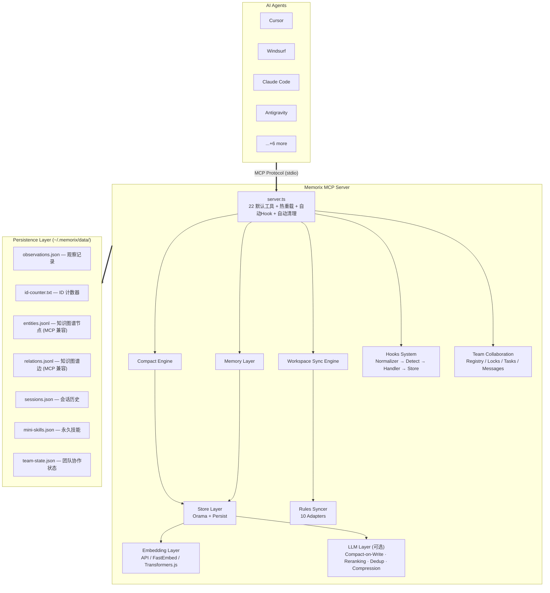

# Memorix 架构文档

> 最后更新: 2026-03-09 (v1.0.0)
> 维护者: 项目创建者 + AI 协作开发

## 项目定位

Memorix 是一个 **跨 AI Agent 的持久化记忆层**，以 MCP (Model Context Protocol) Server 的形式运行。它让 AI Agent 能够在会话之间记住上下文、决策和经验，并在不同 Agent/IDE 之间同步工作环境。

### 核心差异化

| 特性 | MCP Official Memory | Memorix |
|------|---------------------|---------|
| 存储模型 | 纯知识图谱 | 知识图谱 + 结构化 Observations |
| 搜索 | 字符串匹配 | 全文 BM25 + 向量搜索 |
| Token 效率 | 直接返回全量 | 3层渐进式披露 (~10x 节省) |
| 记忆衰减 | 无 | 指数衰减 + 免疫机制 |
| 跨 Agent | 不支持 | Rules/MCP/Workflow/Skills 全同步 |
| 隐式记忆 | 不支持 | Hooks 自动抓取 + 实体自动抽取 |

---

## 系统架构总览



---

## 数据流

### 显式记忆 (Agent 主动调用)

```
Agent --memorix_store--> server.ts
  → observations.ts: 分配 ID, 计数 tokens
  → entity-extractor.ts: 正则抽取文件/模块/标识符
  → enrichConcepts(): 自动丰富概念列表
  → orama-store.ts: 插入搜索索引 (+ 可选 embedding)
  → persistence.ts: 写入 observations.json
  → graph.ts: 确保 entity 存在, 添加 observation 引用
  → auto-relations.ts: 自动创建知识图谱关系
  ← 返回确认 + 自动丰富摘要
```

### 隐式记忆 (Hooks 自动抓取)

```
Agent 操作 (编辑/命令/工具调用)
  → Agent Hook (stdin JSON) → CLI: memorix hook
  → normalizer.ts: 统一多 Agent 格式
  → pattern-detector.ts: 中英双语模式检测
  → handler.ts: 冷却/过滤/阈值判断
  → 满足条件 → observations.ts: 同显式记忆流程
  → stdout JSON → Agent (可注入系统消息)
```

### 搜索 (3层渐进式披露)

```
Agent --memorix_search--> server.ts
  → compact/engine.ts
    → orama-store.ts: 全文/混合搜索
    → index-format.ts: 格式化为 Markdown 表格
    → token-budget.ts: Token 预算管理
  ← L1: 紧凑索引 (~50-100 tokens/条)

Agent --memorix_timeline--> server.ts
  → orama-store.ts: 获取锚点前后 observations
  ← L2: 时间线上下文

Agent --memorix_detail--> server.ts
  → observations.ts: 按 ID 获取完整记录
  ← L3: 完整详情 (~500-1000 tokens/条)
```

---

## 模块分层

### Layer 0: 类型系统 (`types.ts`)
- 所有核心接口定义
- Entity, Relation, KnowledgeGraph (MCP 兼容)
- Observation, ObservationType (claude-mem 风格)
- UnifiedRule, RuleFormatAdapter (规则同步)
- MCPServerEntry, MCPConfigAdapter (工作空间同步)

### Layer 1: 存储层 (`store/`)
- `orama-store.ts` — Orama 全文/向量搜索引擎
- `persistence.ts` — JSONL/JSON 磁盘持久化

### Layer 2: 记忆层 (`memory/`)
- `graph.ts` — 知识图谱管理 (CRUD + 搜索)
- `observations.ts` — Observation 生命周期管理
- `retention.ts` — 指数衰减 + 免疫 + 生命周期分区
- `entity-extractor.ts` — 正则实体抽取 (MAGMA 启发)
- `auto-relations.ts` — 自动关系推断

### Layer 3: Compact 引擎 (`compact/`)
- `engine.ts` — 3层渐进式披露编排
- `index-format.ts` — Markdown 索引表格格式化
- `token-budget.ts` — gpt-tokenizer Token 计数/截断

### Layer 4: Hooks 系统 (`hooks/`)
- `types.ts` — HookEvent, NormalizedHookInput, HookOutput
- `normalizer.ts` — 多 Agent 格式统一化
- `pattern-detector.ts` — 中英双语模式检测
- `handler.ts` — 事件处理 + 冷却 + 噪音过滤

### Layer 5: 工作空间同步 (`workspace/` + `rules/`)
- `workspace/engine.ts` — 跨 Agent 工作空间迁移
- `workspace/mcp-adapters/` — 10个 MCP 配置适配器
- `workspace/workflow-sync.ts` — Workflow 同步
- `workspace/applier.ts` — 配置写入 + 备份/回滚
- `rules/syncer.ts` — 规则扫描/去重/冲突检测
- `rules/adapters/` — 10个规则格式适配器

### Layer 6: 团队协作 (`team/`)
- `team/registry.ts` — Agent 注册/注销/状态
- `team/file-locks.ts` — 协商式文件锁 (10min TTL)
- `team/tasks.ts` — 任务板 + 依赖管理
- `team/messages.ts` — 直接消息 + 广播
- `team/persistence.ts` — team-state.json 读写
- `team/index.ts` — 统一导出

### Layer 7: 基础设施
- `server.ts` — MCP Server 主入口 (22个默认工具 + 9个可选KG工具)
- `cli/index.ts` — Citty CLI 框架 + TUI 配置向导
- `config.ts` — 统一配置读取 (env > config.json > 默认值)
- `project/detector.ts` — Git-based 项目检测
- `embedding/provider.ts` — Embedding 抽象层 (API/FastEmbed/Transformers)
- `embedding/api-provider.ts` — OpenAI-compatible API Embedding (10K LRU 缓存)
- `llm/provider.ts` — LLM 提供者 (OpenAI/Anthropic/OpenRouter)
- `llm/memory-manager.ts` — Compact-on-Write + 语义去重
- `dashboard/server.ts` — Web Dashboard (localhost:3210)
- `skills/engine.ts` — Skills 引擎 (发现/生成/注入)

---

## 部署模式

### 方式 1: 全局安装 (推荐)
```bash
npm install -g memorix
memorix serve
```

### 方式 2: 本地开发
```bash
git clone <repo>
cd memorix
pnpm install
pnpm dev    # tsup watch 模式
pnpm test   # vitest 运行测试
```

---

## 项目规约

- **语言**: TypeScript (strict mode)
- **打包**: tsup (ESM output)
- **测试**: Vitest (753 tests, 56 files)
- **CLI**: Citty (命令定义) + Clack (交互提示)
- **代码风格**: 每个文件顶部有 JSDoc 注释块说明来源和设计意图
- **错误处理**: Hooks 系统永远不抛错 (silent fail), MCP 工具返回 `isError: true`
