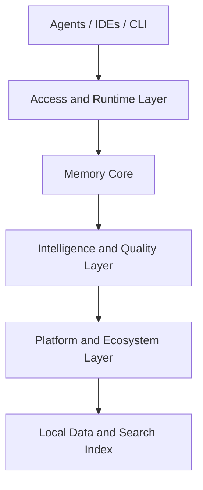

# Memorix Architecture

Memorix is an open-source cross-agent memory layer for coding agents via MCP.

It combines three core memory layers:

- **Observation Memory** for what changed and how things work
- **Reasoning Memory** for why choices were made
- **Git Memory** for engineering truth derived from commits

These layers are exposed through MCP tools, CLI workflows, and an HTTP control plane.

---

## 1. System Shape

Memorix is best understood as a four-layer system:



### Access and Runtime Layer

This layer provides the entry points that agents and users actually talk to.

Main pieces:

- `src/server.ts`
- `src/index.ts`
- `src/cli/index.ts`
- `src/cli/commands/serve.ts`
- `src/cli/commands/serve-http.ts`

Responsibilities:

- register MCP tools
- start stdio or HTTP transport
- manage project switching
- load config and dotenv state
- expose the dashboard and HTTP APIs

### Memory Core

This layer stores, indexes, and serves persistent memory.

Main pieces:

- `src/memory/observations.ts`
- `src/store/orama-store.ts`
- `src/memory/session.ts`
- `src/memory/retention.ts`
- `src/memory/graph.ts`
- `src/memory/consolidation.ts`

Responsibilities:

- assign observation IDs
- persist project-scoped memory
- maintain the search index
- manage session state
- retention, archive, and deduplication
- knowledge graph entities and relations

### Intelligence and Quality Layer

This layer improves memory quality and retrieval quality.

Main pieces:

- `src/memory/formation/`
- `src/search/intent-detector.ts`
- `src/compact/engine.ts`
- `src/llm/quality.ts`
- `src/embedding/provider.ts`

Responsibilities:

- formation pipeline
- fact extraction and evaluation
- source-aware retrieval
- compact formatting and token budgeting
- optional embedding-backed semantic search
- optional LLM-assisted quality improvements

### Platform and Ecosystem Layer

This is the layer that makes Memorix more than a simple MCP memory server.

Main pieces:

- `src/hooks/`
- `src/git/`
- `src/workspace/`
- `src/rules/`
- `src/team/`
- `src/skills/`
- `src/dashboard/`

Responsibilities:

- IDE hook capture
- Git Memory ingestion
- workspace and rule sync across agents
- team collaboration
- mini-skills and memory-driven workflows
- dashboard and control plane APIs

---

## 2. Core Memory Layers

### Observation Memory

Observation memory captures operational and architectural facts such as:

- `what-changed`
- `problem-solution`
- `decision`
- `trade-off`
- `gotcha`
- `how-it-works`

This is the main general-purpose memory layer.

### Reasoning Memory

Reasoning memory stores the thinking behind non-trivial decisions:

- why a choice was made
- alternatives considered
- constraints
- expected outcomes
- known risks

This layer is useful when a future agent asks:

- why did we do this?
- what trade-off did we accept?

### Git Memory

Git Memory turns commits into structured memory with source provenance:

- `source='git'`
- `commitHash`
- changed files
- inferred observation type
- extracted concepts

This creates an engineering truth layer that complements human- or agent-authored observations.

---

## 3. Main Data Flows

### Explicit store flow

```text
Agent or user
  -> memorix_store / memorix_store_reasoning
  -> validation and enrichment
  -> observation persistence
  -> search index update
  -> graph update
```

### Git Memory flow

```text
git commit
  -> post-commit hook
  -> memorix ingest commit --auto
  -> git extractor + noise filter
  -> observation persistence
  -> search index update
```

### Hook capture flow

```text
IDE hook event
  -> normalize
  -> detect pattern and significance
  -> optional memory write
  -> session-aware context update
```

### Retrieval flow

```text
memorix_search
  -> project-scoped search by default
  -> BM25 or hybrid retrieval
  -> source-aware reranking
  -> compact result formatting

memorix_detail
  -> full observation lookup
  -> optional project-aware refs for global hits

memorix_timeline
  -> surrounding chronological context
```

---

## 4. Retrieval Model

Memorix does not treat all memory equally.

### Default scope

- `memorix_search` defaults to the current project
- `scope="global"` searches across projects
- global hits can be opened with project-aware refs in `memorix_detail`

### Source-aware retrieval

Retrieval weights memory differently depending on intent:

- "what changed" style queries boost Git Memory
- "why" style queries boost reasoning and decision memory
- "problem" style queries can boost both operational fixes and Git Memory

### Progressive disclosure

Memorix retrieval is layered:

- compact search results
- timeline context
- full detail only when explicitly requested

This keeps normal retrieval efficient while still allowing deep inspection.

---

## 5. Project Identity Model

Project identity is central to Memorix.

Main idea:

- memory is project-scoped by default
- project IDs come from Git identity
- aliases and identity health are tracked explicitly

This prevents unrelated repositories, IDE install folders, or system directories from polluting the same memory namespace.

Useful runtime tools and surfaces:

- `memorix status`
- dashboard identity health page
- global search with project-aware refs

---

## 6. Configuration Model

Memorix is intentionally converging on:

- `memorix.yml` for behavior
- `.env` for secrets

Resolution order:

### Behavior settings

1. environment variables
2. project `memorix.yml`
3. user `~/.memorix/memorix.yml`
4. legacy `~/.memorix/config.json`
5. defaults

### Secrets

1. shell or host-provided environment variables
2. project `.env`
3. user `~/.memorix/.env`

The dashboard and `memorix status` expose config provenance so the active value source is visible.

---

## 7. Runtime Modes

### `memorix serve`

Starts the stdio MCP server.

Use this for:

- Cursor
- Claude Code
- Codex
- Windsurf
- other stdio MCP clients

### `memorix serve-http --port 3211`

Starts the HTTP MCP server and the main dashboard.

Use this when you want:

- an HTTP MCP endpoint
- one shared Memorix process for multiple agents
- Team features
- the control plane dashboard

Main URLs:

- MCP endpoint: `http://localhost:3211/mcp`
- dashboard: `http://localhost:3211`

### `memorix dashboard`

Standalone dashboard mode.

Useful for local inspection and debugging, but the main product mode is the dashboard embedded in `serve-http`.

---

## 8. Dashboard as Control Plane

The dashboard is no longer just an observation browser.

It acts as a control plane for:

- memory source breakdown
- Git Memory visibility
- config provenance
- identity health
- sessions
- retention state
- team collaboration in HTTP mode

This is part of Memorix's shift from a single MCP server to a broader local memory platform.

---

## 9. Design Goals

Memorix is designed around a few guiding ideas:

- **Local-first**: memory should stay on the developer machine by default
- **Project-safe**: default recall should respect project boundaries
- **Cross-agent**: different tools should share one memory base
- **Layered truth**: Git Memory, observation memory, and reasoning memory each serve different jobs
- **Quality over volume**: retention, formation, compaction, and noise filtering matter as much as raw storage

---

## 10. Related Docs

- [Setup Guide](SETUP.md)
- [Configuration Guide](CONFIGURATION.md)
- [Git Memory Guide](GIT_MEMORY.md)
- [API Reference](API_REFERENCE.md)
- [Development Guide](DEVELOPMENT.md)
